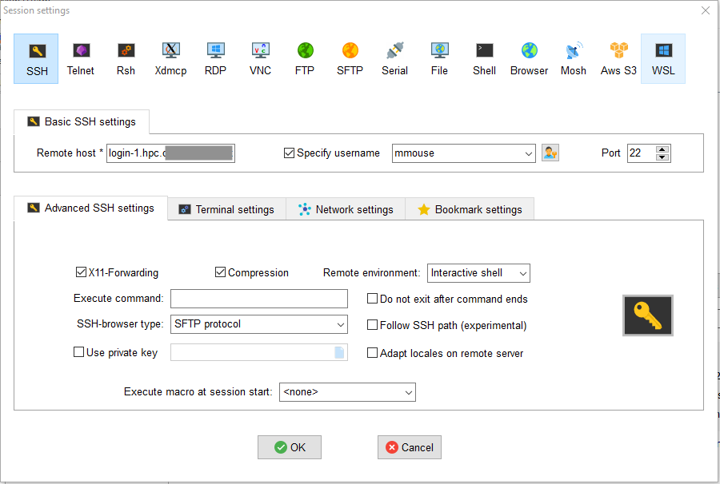
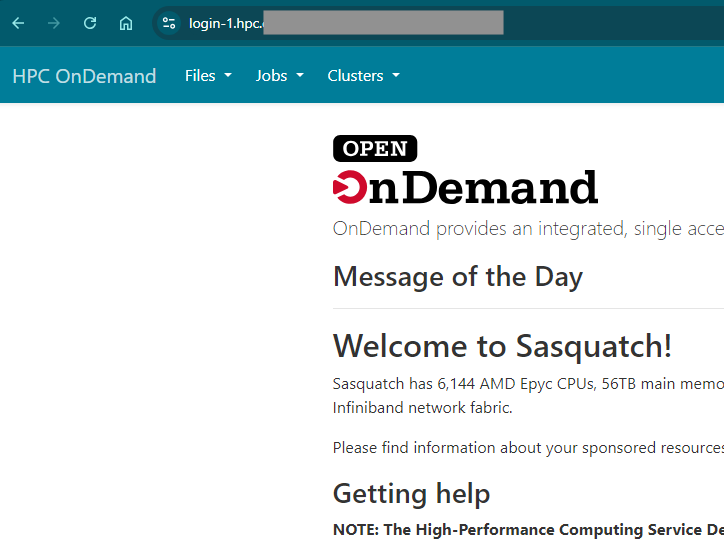

There are a few steps that you will need to take to get access to the HPC. These may change as we continue to streamline our processes.

## Basic steps for access

1.  Submit a "onboard my user" [ticket]() to request an account. After you request an account, it may take up to seven days for you to get access. You will receive an email once you have access.

2.  Once that is done, you are able to use the resource, following this basic guide. You may want to have someone from our team give you an orientation and make sure you are set up for success. Also, if you are new to Linux or to using a cluster you will likely benefit from one or more of our [training classes](#). Please contact Research Scientific Computing via the [forums](#) or [email](#) for help or if you would like more information.

## Accessing the cluster

Your computer from which you want to connect to the HPC must be on the Company Network. This includes

-   computers with wired intranet connections

-   Company imaged laptops over Company wifi

-   externally located laptops connected through Zscalar

-   personal computers connected with Citrix

Once on the Company network you can use any SSH client to connect to the HPC with your Company user name and password. For a more interactive experiences, you can connect using the Sasquatch OnDemand portal or Posit Workbench. Specific examples are given below.

## Command line only (ssh)

If you are using a machine connected to the internal network or are connected to Zscalar, you can use a terminal to ssh directly to Sasquatch.

For all methods of connecting, you have a choice between two equivalent login nodes, "" and "". These have access to the same resources, but are different computers. If you like to use `tmux` or `screen` for working interactively, it is best to pick one login node and stick with it, since all of your sessions will be specific to the node on which they were launched. However, there will be times when one login node might crash or be taken down for maintenance, in which case you should switch to the other login node.

### Connect from a terminal (Mac OS and Linux)

Open a terminal running a BASH shell and connect with ssh:

``` bash
ssh -YC username@
```

The -Y flag enables X11 forwarding, useful if you are running graphical applications. The -C flag enables compression, which will be more performant.

### Connect from a terminal (Windows 10)

Windows 10 users can use Command Prompt, PowerShell, or Windows Subsystem for Linux (WSL) if it is enabled. Open either of these terminals and connect with ssh:

``` bash
ssh username@
```

PowerShell does not support X11 forwarding.

### Connect with MobaXterm (Windows, any version)

Before Windows 10, Windows did not normally come with a standard terminal application that supported ssh. There are several common applications that you can download, e.g. MobaXterm or PuTty. The following example uses MobaXterm, but something similar would apply to any other terminal application.

#### Download MobaXterm

[Download MobaXterm here](https://mobaxterm.mobatek.net/download-home-edition.html)

-   If you have admin privileges on your Windows machine, use the installer edition of MobaXterm.

-   If you do not have admin privileges, use the portable edition.

#### Simple ssh connection

From the MobaXterm homescreen

-   Start local terminal

-   Connect with ssh:

``` bash
ssh username@
```

-   MobaXterm launches an X11 session automatically, so no need to include the `-Y` flag

-   When prompted for a password, the cursor will not give you any feedback as type; in other words you will be typing blindly and this is expected behavior

#### Using a saved ssh connection

To configure your connection to the HPC in MobaXterm, do the following (also see figure below):

-   create a new SSH session

-   specify the remote host as "" or ""

-   check "Specify username"

-   enter your Company user name

-   Under "Advanced SSH settings tab", make sure "X11-Forwarding" and "Compression" are checked (Note that X11 forwarding does not work in the portable edition)



### Set up password-less login

For details about password-less login with SSH keys please visit our chapter on [Using SSH keys](UsingSSHKeys.qmd#Understanding-SSH-Keys)

## Interactive portal (HPC OnDemand)

### What is Open OnDemand (from the web site):

Open OnDemand provides powerful new capabilities to HPC users. Open OnDemand is an NSF-funded open-source HPC portal based on OSC’s original OnDemand portal. The goal of Open OnDemand is to provide an easy way for system administrators to provide web access to their HPC resources, including, but not limited to:

-   Plugin-free web experience

-   Easy file management

-   Command-line shell access

-   Job management and monitoring across different batch servers and resource managers

### Connecting to HPC OnDemand

From within the Company network, point your browser to one of these two locations: [https:///](https:///) or [https:///](https:///)

Once there, you need to log in using your standard Company password and short username.

**Note: First time users will need to follow the on screen instructions to create a home directory after logging in for the first time.**

#### What can I do from the portal?



-   You can access the command line

-   You can access your files

-   You can see what jobs are running on the cluster

The "Files" tab is a convenient way to transfer files between your local PC and your home or association directories. However, please do not use this interface to transfer data between your PC and RSS (Helens or Baker). Doing so puts strain on our network. Please use the Research Storage Services [guidelines](#) instead.

## Posit Workbench

Posit Workbench provides Interactive Development Environments (IDEs) that are fully integrated with Sasquatch. This allows you to use tools such as RStudio, VSCode, and Jupyterlab to interact with files in your home and association directories as well as to submit jobs directly to the cluster from within your IDE.

See the section on [Posit Workbench](Posit.qmd) for more information.

## Local IDEs

See @sec-usinglocalide.