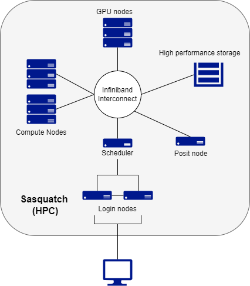

# Introduction to HPC clusters {#sec-introhpc}

```{r setup1, include=FALSE}
knitr::opts_chunk$set(echo = TRUE, eval=FALSE, include=TRUE)
library(knitr)
```

This introduction section is intended for Company users new to High Performance Computing. It gives a high level overview of the HPC resources at Company and helps new users start utilizing those resources. It is recommended to read through this guide first to get a general understanding of how things work before reading the cluster specific user guides.

## When to use a HPC cluster

Research problems that use computing can sometimes outgrow the desktop or laptop computer where they started.

There might not be enough memory, not enough disk space or it may take too long to run computations.

These days, a typical desktop or laptop computer has up to 16GB of memory, a small number of CPU cores and several TB of disk space. When you run your computations on a computer, the program and data get loaded from the disk to the memory and the program's commands are executed on the CPU cores. Results of the computations are usually written back to the disk. If too much data needs to be loaded to memory, the computer will become unresponsive and may even crash.

Typical cases of when it may be beneficial to request access to an HPC cluster:

* computations need much more memory than what is available on your computer

* same program needs to be run multiple times (usually on different input data)

* program that you use takes too long to run, but it can be run faster in parallel (usually using MPI or OpenMP)

* you need access to a GPU accelerator (your program needs to be written in a way that allows it to use your GPU).

One should not expect that any program will automatically run faster on a cluster. In fact a serial program that does not need much memory may run slower on an HPC cluster than on a newer laptop or desktop computer. However, on a cluster one can take advantage of multiple cores by running several instances of a program at once or using a parallel version of the program.

Additionally, not every application that requires lots of memory or CPUs is a good fit for the cluster. Typical cases of when you might need to request a dedicated server:

* software is Windows based

* software requires a proprietary license

* the workflow requires a significant amount of interaction and/or user input

* the workflow is intended to run as a standing service

## What is an HPC cluster {#sec-introhpc_hpccluster}

An HPC cluster is a collection of many separate servers (computers), called nodes, which are connected via a fast interconnect.



There may be different types of nodes for different types of tasks.

The Company HPC cluster, Sasquatch, has the following components:

* 2 login nodes, where users log in

* regular compute nodes (where majority of computations are run)

* GPU nodes (on these nodes computations can be run both on CPU cores and on a Graphical Processing Unit)

* a Posit node for running RStudio, Jupyter, and VSCode

* an Infiniband switch to connect all nodes

All cluster nodes have the same components as a laptop or desktop: CPU cores, memory and disk space. The difference between personal computer and a cluster node is in quantity, quality and power of the components.

Users log in from their computers to the cluster headnode using Sasquatch OnDemand or the ssh program.

## Cluster Storage

Since many users have accounts on a cluster, and some computations use very large data sets, much more space is needed to store all user data compared to a personal computer. Usually on a cluster there are several types of storage.

Like a desktop or laptop computer, individual cluster nodes often have local disk drives. Since this storage is local to a node, it is usually faster to access by the processes running on the node. On our HPC cluster these local drives are used for system software and for scratch space that is available to user's processes. As the name suggests, files in the scratch space are meant to be deleted regularly. The local drives on compute nodes are usually not made accessible to processes running on other nodes.

Most of the data on a cluster is kept in separate storage units that have multiple hard drives. These units are called file servers. A file server is a computer with the primary purpose of providing a location to store data. Regular users do not log in to file servers. On HPC clusters these file servers are connected to the same Infiniband switch that connects all nodes, providing relatively fast access to data from all cluster nodes.

Every user on a cluster has a home directory. If you type `pwd` right after connecting to a cluster, you should see /data/hps/home/\<username\>, where \<username\> is your Company User ID. Physically, home directories can be located on the drives on the login node, on a service node or on a separate file server. In any case home directories are mounted and thus can be accessed on any cluster node.

Since there are multiple users on a cluster, to minimize one user's actions affecting other users, home directories have quotas. On HPC clusters listed on this site, one can not keep more than 100 GB of data in their home directory. The home directory should be mainly used for configuration and login files, as well as conda environments and personal installations of R packages. This is kept deliberately small to prevent abuse of the home directory as extra storage.

On Sasquatch, there are also association directories, which are shared among users within a group (e.g. a lab). These are reserved by PIs in increments of 1 TB.

Both home and association directories are backed up to hidden directories. An even safer place to keep important files is the [Research Storage Services (RSS)](#) servers (i.e. Helens and Baker). See the [chapter on data storage](DataStorageTransfer.html) for instructions on how to copy data between the RSS servers and Sasquatch, or how to restore deleted files.

## How an HPC works

Using an HPC cluster is slightly different than sitting in front of your personal computer. 

Here is the basic workflow on an HPC cluster.

1. A user logs in to one of the two head nodes on the HPC.

2. A user submits a "job" to the scheduler.

3. The scheduler dispatches that job to one of the compute nodes.

4. The compute node completes the job, writing any outputs to disk.

Users typically access the cluster by logging on to one of the two head nodes (log-in nodes). While these are fully functional nodes, they are designed to be a landing and launching pad for users work. Users are not meant to perform their computations on these nodes, and processes run on these will likely be shut down by the administrators. 

In order to get work done, a user submits a "job" to the scheduler. A job could either be a script (batch job) that has a set of pre-written instructions, or an interactive session (interactive job) where the user can execute commands interactively (for example an RStudio or Jupyter session). In either case, during the submission, the user specifies the resources that will be needed to complete the job (e.g. # of CPU cores, amount of memory, the amount of time needed, etc.)

The scheduler receives all the job submissions from all users. It decides the most efficient way to process these jobs and which compute nodes are available based the resources requested. It then puts them in a queue for dispatch and execution as those resources become available.

Once dispatched, the job will execute. If a batch job, the compute node executes the instructions in the script, writing any outputs to the designated output directories. If an interactive job, the user is directed to a terminal on the compute node where they can interactively submit commands.
