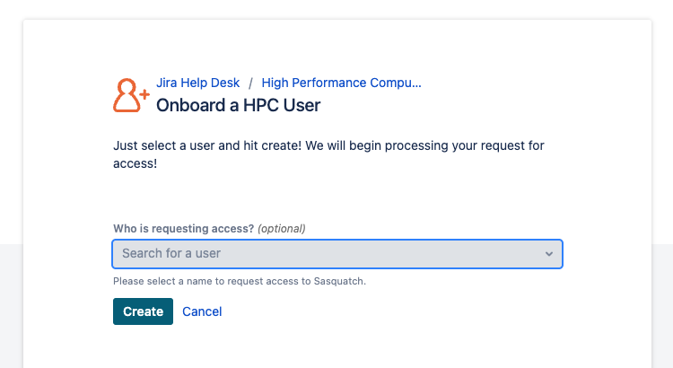
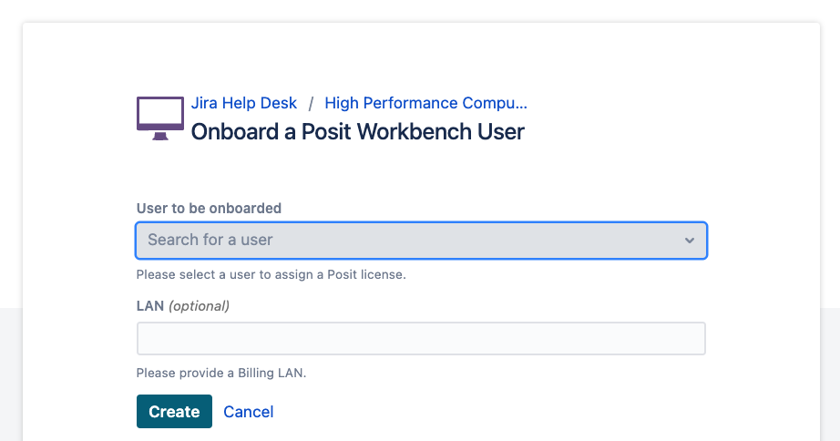
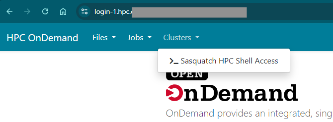
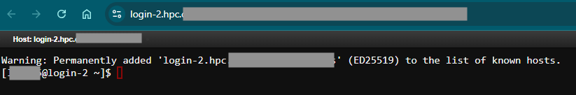

# Onboarding and Setup {#sec-onboard}

This is intended as a quick start for Sasquatch, the high performance computing cluster at Company. For more detailed information, we highly recommend reading the full [HPC Guide](HPCintro.qmd), attending our [Intro to Scientific Computing course](#), and joining us during [office hours](GettingSupport.qmd).

## Onboard as a Sasquatch user

To leverage resources or access to Sasquatch can be requested by submitting a ticket through [Onboard a HPC User](). \*Access setup may take up to seven days after your request is submitted.

{width="600"}

## Optional: Request an association

What is the Association? For Sasquatch, associations define a set of users who have access to a shared set of compute and storage resources. If you anticipate doing heavy computation on Sasquatch, needing storage and scratch space beyond 100 GB, and/or needing storage space that is shared with other users, you will need to have an association.

To request a new association can be requested through [Create a new Association]() or ask to be added to an existing one through [Join an Association]().

{width="600"}

## Optional: Request Posit Workbench access

If you plan to use R(Rstudio) or Python(VSC, Jupyter Lab) on a regular basis, we highly recommend getting a Posit Workbench license. You can request Posit Workbench access through [Onboard a Posit Workbench User]().

{width="600"} 

Once you are granted access, you can log in to Posit Workbench at []()

### Optional: R setup

If you are using R and are a member of an association, we highly recommend storing your R packages in your association space so that you don't fill up your home directory with them. Using a text editor in the bash terminal, OpenOnDemand web interface, or RStudio, open the file `~/.Renviron` for editing, creating it if it doesn't exist yet.

To `~/.Renviron`, add the line:

``` bash
R_LIBS_USER_BASE_PATH=""
```

replacing "mylab" with your association name and "mmouse" with your user name. This is now your default location for installing R packages.

## Optional: Request Posit Connect access

Posit Connect enables you to share HTML files, PowerPoint presentations, and Shiny applications developed in Posit Workbench. If you would like to use this service, please request a license through [Onboard a Posit Connect User]().

{width="600" height="260"} 

## Logging on

We have two login nodes, [``](https:///) and [``](https:///). You can use them interchangeably. The easiest way to log on is using Open On Demand. While connected to the Company network (on site or via Zscalar or Citrix), click one of those two links or paste the node name into your web browser. You will get prompted to sign in, which you can do with your Company password and short user name.

Once you are logged in, at the top of the screen click "Clusters" and then "Sasquatch HPC Shell Access"



After doing this, you will find yourself at a bash terminal on a login node.




## Install Mamba {#sec-onboard_mamba}

There are several options for getting the software you need, but mamba/conda is one of the more useful approaches. You are going to install a personal copy of mamba for your use. You only need to do this once.

First, download the installation script:

``` bash
wget https://github.com/conda-forge/miniforge/releases/latest/download/Miniforge3-Linux-x86_64.sh
```

Then run the installer.

``` bash
bash Miniforge3-Linux-x86_64.sh
```

-   Follow the prompts on the screen, and accept the license agreement.
-   You will be prompted for an installation location, with the default being in your home directory.
    -    **IMPORTANT** We recommend installing it in your association, e.g. `/miniforge3`.
    -    If you don't change this, your home will fill up with a bunch of small files unless you only make a couple tiny environments.
-   **IMPORTANT** Say `yes` to updating your shell profile. 
-   Once you are done, the `miniforge3` directory will exist.

Then set up your environment to use mamba:

``` bash
source ~/.bashrc
mamba deactivate
conda config --set auto_activate_base false
conda config --set env_prompt '({name})'
source ~/.bashrc
```

Official install instructions at [mamba.readthedocs.io](https://mamba.readthedocs.io/en/latest/installation/mamba-installation.html) and from their [GitHub](https://github.com/conda-forge/miniforge?tab=readme-ov-file#install).

See [Using Mamba/Conda](Mamba.qmd) for more information about using mamba on Sasquatch.

## Optional: Connect to Bitbucket and configure Git

If you use Git (which we highly recommend if you write code regularly) you will want to be able to push and pull from the Company Bitbucket. Do this one-time setup on Sasquatch to make an SSH key:

``` bash
ssh-keygen -t ed25519
```

Then print out your public key:

``` bash
cat ~/.ssh/id_ed25519.pub
```

Go to https://ea-bitbucket-prod./, click on your avatar in the upper-right, go to "Manage account", then "SSH keys", then "Add key" and paste in the whole string from the public key, starting with "ssh-ed225519" and ending with "\@login-1". Click "Add key" after pasting it in, and you are all set.

If you have more questions about SSH keys, please see our chapter [Using SSH keys](UsingSSHKeys.qmd#Understanding-SSH-Keys).


You will also want to set your name and email for Git.

``` bash
git config --global user.name "Doe, Jane"
git config --global user.email "Jane.Doe@company.org"
```

See [Using Git](UsingGit.qmd) for more information about using Bitbucket and version control on Sasquatch.

## Logging off

-   Use the `exit` command to end a session on a worker node if you are done.
-   Use <kbd>Ctrl</kbd> + <kbd>b</kbd> <kbd>d</kbd> to detach from your `tmux` session.
-   Use `exit` do disconnect from the login node.
