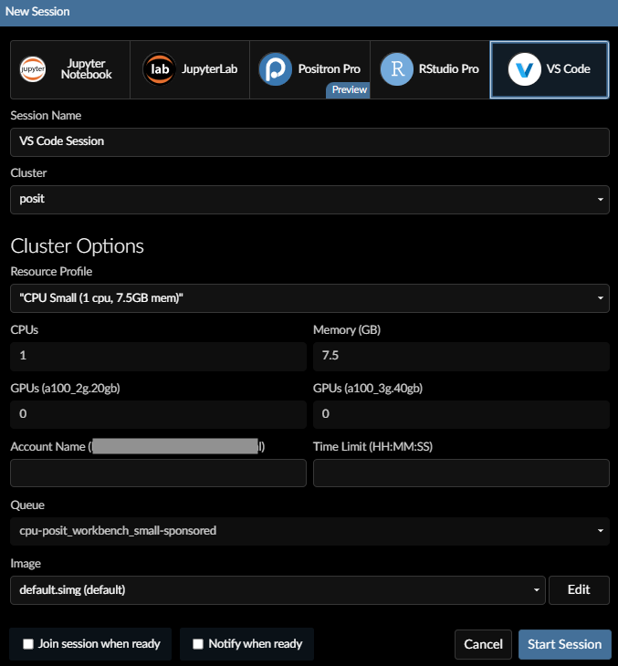
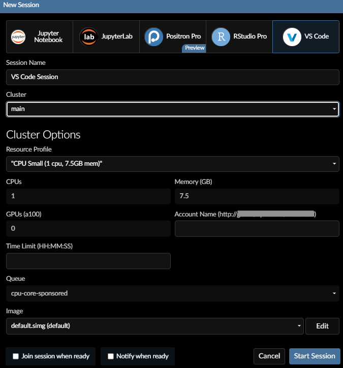

# Posit session {#sec-posit}

This is the page to help you use our [Posit server webpage]() to launch a session on [posit](#cluster---posit) or [main](#cluster---main) clusters

[Release Notes are available](#release-notes)

## Choose your Cluster 

-   [`posit`](#configuring-posit-cluster)\

    -   These cluster options are for dedicated interactive sessions only. Users will have strict time limits and access to fewer resources but you should have short waits to get a session started.\

-   [`main`](#configuring-main-cluster)\

    -   These clusters are pulled from the non-interactive (batch) pool of resources. Users will have less strict time limits and more resources available (except no access to GPUs for interactive sessions) but you may need to wait to get a session started based on resource availability.\

## Configuring `posit` cluster

:::{.callout-important icon=true}
## ATTENTION: You need to specify Account Name
If you don't specify the correct account name (see <a href="#account_name_id">below</a>) the launcher will throw an error.
:::

Limit of 2 Sessions total with max 1 GPU and Maximum of 12 hours walltime ([posit policy](Policies.qmd#job-submissions-on-posit-partition)).

::: columns
::: {.column width="50%"}
\

:::

::: {.column width="50%"}

**Fields**\

-   **IDE**: Select the IDE (Interactive Development Environment).\
**Experimental Feature** Positron is in Beta Preview ([policy](Policies.qmd#experimental-features)).\

-   **Session Name**: The name of your job running the interactive session.\

-   **Cluster**: `posit`\

-   **Resource Profile**:\
`CPU Small` has a dedicated space available ([policy](Policies.qmd#job-submissions-on-posit-partition)).\

-   **CPUs**: Number of CPUs for your requested session.\

-   **Memory**: Amount of memory for your requested session.\

-   **GPUs**: **Experimental Feature**\
Size of parts of a [A100 GPU](#using-gpu) for your requested session.\
`2g_20gb` is 2/7 of a [A100 GPU](#using-gpu) with 20GB of VRAM and\
`3g_40GB` is 3/7 of a [A100 GPU](#using-gpu) with 40GB of VRAM.\
Rendering is not supported.\

-   Account Name:\
    `cpu-posit_workbench-sponsored` or\
    `gpu-posit_workbench-sponsored` if using [GPU](#using-gpu)\

-   **Time Limit**: `HH:MM:SS` (e.g. 10:00:00 for 10 hours)\
max is 12 hours\

-   **Queue**: set automatically.\
`cpu-posit_workbench_small-sponsored` (only `CPU Small`),\
`cpu-posit_workbench-sponsored` (all other `CPU XXX`Sizes),\
`gpu-posit_workbench-sponsored` (for [`GPU`](#using-gpu))\

-   **Image**: ``\
The number at the end of the filename is the date the image was created.\

:::
:::

## Configuring `main` cluster

:::{.callout-important icon=true}
## ATTENTION: You need to specify Account Name
If you don't specify the correct account name (see <a href="#account_name_main_id">below</a>) the launcher will throw an error.
:::

Limit of 2 Sessions and Maximum of 14 days walltime, Queue times subject to cluster demand ([main policy](Policies.qmd#job-submissions-on-main-partition)).

::: {.columns}
::: {.column width="50%"}
\

:::
::: {.column width="50%"}

**Fields**\

-   **IDE**: Select the IDE (Interactive Development Environment).\
**Experimental Feature** Positron is in Beta Preview ([policy](Policies.qmd#experimental-features)).\

-   **Session Name**: The name of your job running the interactive session.\

-   **Cluster**: `main`\

-   **Resource Profile**: \
if using `Custom`, select the appropriate <a href="#queue_main_id">queue</a>.\

-   **CPUs**: Number of CPUs for your requested session.\

-   **GPUs**: **Experimental Feature**\
Number of [full size A100 GPUs](#using-gpu) for your requested session.\
If using `Custom`, set <a href="#queue_main_id">queue</a> to `gpu-core-sponsored`.\
Rendering is not supported.\

-   **Memory**: Amount of memory for your requested session.\
If using `Custom`,\
`cpu-core-sponsored` max = 960 \
`gpu-core-sponsored` max = 1920 \

-   Account Name:\
    `cpu-`yourlab`-sponsored` (e.g. `cpu-rsc-sponsored`).\
    If using [`GPU`](#using-gpu), use `gpu-`yourlab`-sponsored`.\
    You can find your association information via\
    `sshare -o "Account%40,Partition%40"` on sasquatch terminal.\

-   **Time Limit**: `D-HH:MM:SS` (e.g. 10:00:00 for 10 hours)\
Max is 14 days.\

-   **Queue**: Select this if using **Resource Profile** `Custom`\
`cpu-core-sponsored` for jobs without GPUs.\
`gpu-core-sponsored` for jobs with GPUs.\

-   **Image**: ``\
The number at the end of the filename is the date the image was created.\

:::
:::

## Using GPU

Our cluster is outfitted with 4 NVIDIA A100 GPUs per node. Check [here for Specificiations](https://www.nvidia.com/en-us/data-center/a100/#specifications).\
The image `` includes [CUDA Toolkit](https://docs.nvidia.com/cuda/cuda-toolkit-release-notes/index.html)([Matrix](https://docs.nvidia.com/cuda/cuda-toolkit-release-notes/index.html#id6)) and [CUDA Compat](https://docs.nvidia.com/deploy/cuda-compatibility)([Matrix](https://docs.nvidia.com/deploy/cuda-compatibility/#id3)) based on the drivers installed for the GPU nodes.

## Release Notes {#release-notes}

*(Note: Each image builds upon the contents of the previous images along with fixes, upgrades, etc.)*

### `posit-base-20250818.sif`

-   Overview
    -   Split posit images to
        - Smaller default image (3.67G) that contains only the most recent version of R (4.5.1) and Python (3.13.7) without CUDA packages builtin for faster startup/loadtimes.
        - Larger alternate image (11.91G) that contains all the supported software versions for backwards compatibility.
-   Upgraded
    -   Upgraded IDEs (RStudio, VSCode, JupyterLab, Posit)
    -   Upgrade R 4.2.3 4.3.3 4.4.3 4.5.1
    -   Upgrade Python 3.9.23 3.10.18 3.11.13 3.12.11 3.13.7
    -   Upgrade Quarto 1.7.33
    -   Upgrade Slurm 24.11.6
-   New capabilities
    -   Added shortened account and partition names for better user experience.
        - **Users are expected to adopt the new names over the next couple of months.**
-   Fixes
    -   N/A

### `posit-base-20250605.sif` *(decommissioned)*

-   Overview
    -   Primarily fixing publishing to connect
-   Upgraded
    -   N/A
-   New capabilities
    -   adds RENV related paths automatically for the user for publishing dynamic content to connect (e.g. Shiny Apps)
-   Fixes
    -   Publishing to connect

### `posit-base-20250522.sif` *(decommissioned)*

-   Overview
    -   Primarily adding support for ncdf4 R package
-   Upgraded
    -   N/A
-   New capabilities
    -   install ncdf4-devel to add nc-config to the container for ncdf4 R package (package installed)
-   Fixes
    -   fixed pdf rendering for Quarto and RMarkdown documents

### `posit-base-20250501.sif` *(decommissioned)*

-   Overview
    -   Lots of upgrades and new capabilities added to the HPC!
-   Upgraded
    -   Expanded R support: (4.5.0, 4.4.3, 4.3.3 and 4.2.3)
    -   Expanded Python support: (3.9.22, 3.10.17, 3.11.12, 3.12.2, 3.13.2)
    -   Upgraded IDEs (RStudio, VSCode, JupyterLab, Jupyter Notebook)
    -   Upgraded Quarto (1.6.43)
    -   Upgraded/patched the base OS for the entire cluster
    -   Upgraded/patched supporting software (slurm, apptainer, posit workbench, and cluster management software)
    -   GCC toolset 13 to 14
    -   Contents of the "Bioinformatics association" are now more widely available for all users
    -   Better support in terms of pre-built containers.
    -   A new test partition (gpu-test-sponsored,cpu-test-sponsored: 15 minutes time limits)
-   New capabilities
    -   Multiple language support
    -   Added **Experimental Feature** GPU (Driver Version: 570.124.06) support in Beta Preview
        -   launch container with `apptainer --nv` then exec or shell as normal to get nvidia drivers
        -   CUDA Toolkit 12.8 built-in to the container for the current GPU drivers
        -   CUDA compat for full backwards compatibility
        -   cuDNN 9.8 - in beta support
    -   Added **Experimental Feature** Positron in Beta Preview
    -   OpenPMIx for MPI workflows added in beta support
-   Fixes
    -   rJava support
    -   rJags support with JAGS 4.x
    -   Posit mirror of bioconductor is fixed (run install.packages() to install from posit mirror)
-   Known Bugs/Issues
    -   Posit Workbench Launcher UI fails to read input for all fields
        -   Workaround: clear and re-input each field each time to launch a session
    -   Jupyter Notebook, JupyterLab, Positron, VSCode IDEs overwrite LD_LIBRARY_PATH defined by container
        -   Workaround: `source /container/fix_my_ide.sh`
    -   RStudio overwrites PS1 defined by container
    -   Positron can't use system python installations (`/opt/python*`)
        -   Workaround: users can launch mamba environments
    -   Posit Workbench Launcher UI unable to disable `Suspend` button
        -   Tip: Users should save data/code often and not use `Suspend`/`Resume` at all
    -   Posit sessions not fully terminating and preventing users from launching full set of active sessions
        -   Please contact system administrators to get rid of zombie sessions in "HPC -\> General"

### `posit-session-rsc-Rocky9-20240815.sif` *(decommissioned)*

-   Overview
    -   Introduced posit to Company
-   Upgraded
    -   N/A
-   New capabilities
    -   VSCode available
-   Fixes
    -   N/A