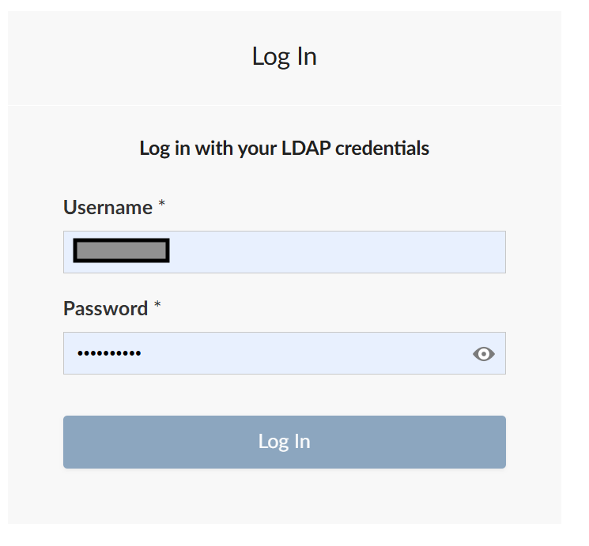
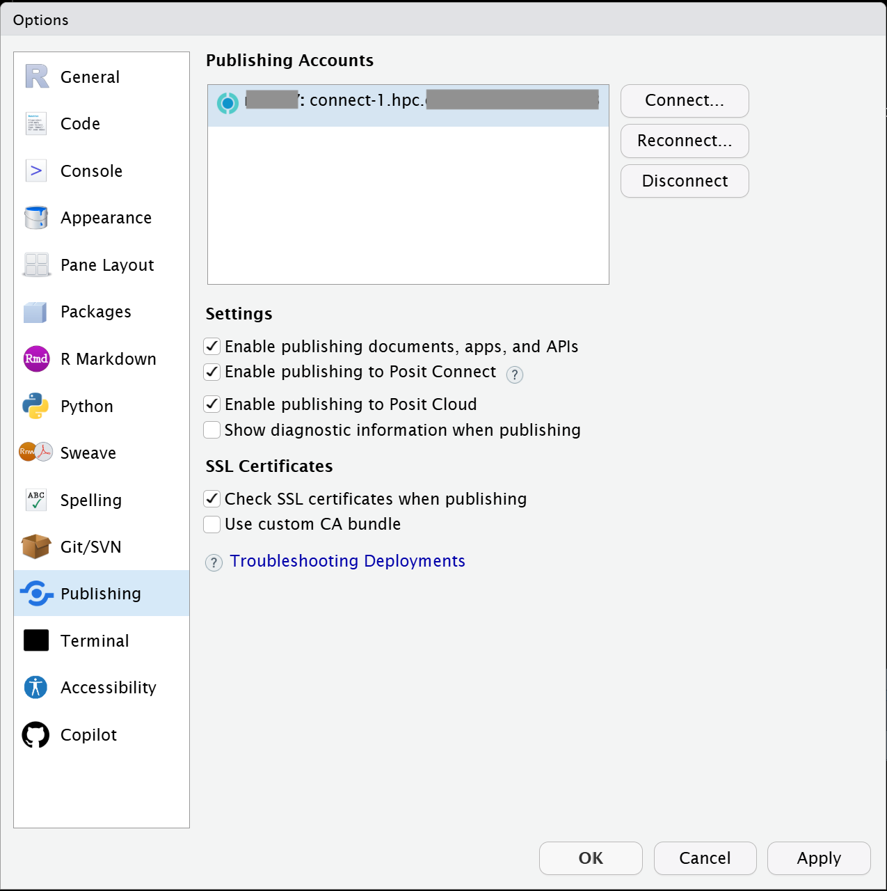
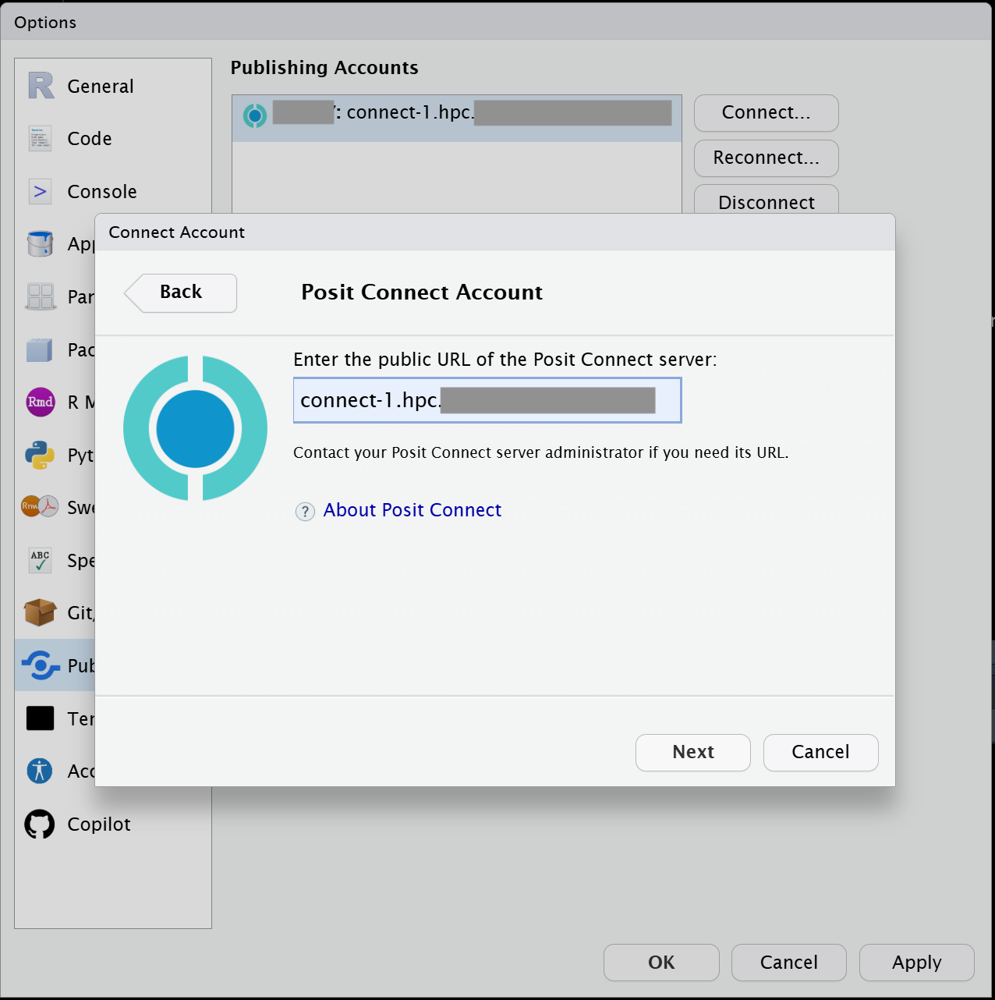
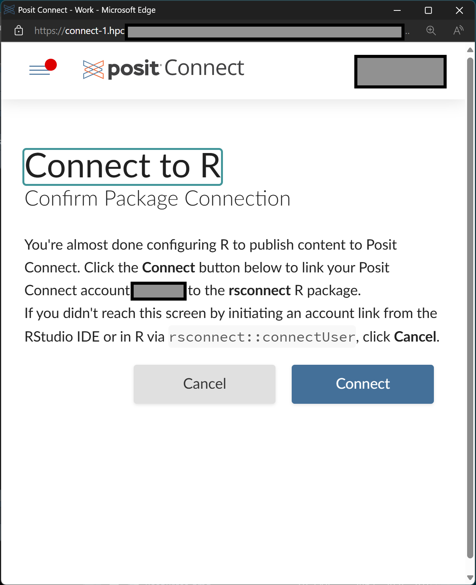
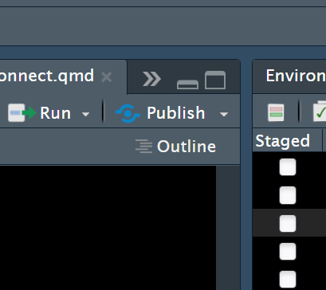
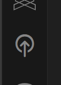

# Posit Connect {#sec-positconnect}

## What is Posit Connect?

So if you use the Posit workbench IDEs, then you are probably doing at least a some data science.  Perhaps you make shiny apps, or perhaps you make reports using quarto documents or python notebooks?  For any of these tools, you may want to be able to publish those outputs as 'reports' for collaborators.  Allowing you to easily publish your documents and apps is exactly what Shiny Connect is for.

[Official Posit Connect user guide](https://docs.posit.co/connect/user/)

## Logging in to Posit Connect

While on Zscalar, Citrix, or theCompany network, go to our [Posit server webpage](). Log in with yourCompany short user name and password.



Not everyone with a Sasquatch account is automatically granted Posit Connect access.  If you want to be able to publish OR to be able to have things published to you in a private way. You may need to request Posit connect access.  To do this, use the [Jira help desk]().

Once you have logged in, you should be taken to a page that lists content that you have access to.  The content might have been shared with you by others, or it might be content that you published.  But either way, this is where you come to see what is available.

## But how do you push content to the connect server?

There are multiple different answers to this question!  

* One way is by pushing content directly from an IDE. 

* In addition, you can ALSO push content directly from R or Python scripts. 

Here I will try to give you a few examples so that you will know about multiple options.


## Publishing from the RStudio IDE

Perhaps the most common thing people do is to push their quarto or shiny apps directly from the RStudio IDE.  To do this, you will need to have RStudio running.  

* You can do that by just launching an IDE from Workbench OR from your local PC (both should work so long as you are on the network and can see the connect server).

* Once inside of RStudio, choose "Global Options" from the "Tools" menu.

* Once you have the "Global Options" open, choose "Publishing from the menu on the left

Your screen will look a little like this, (but without the highlighted connection - yet)



* Hit the "Connect" button to establish a connection with the local connect server

* On the next popup, choose "Posit Connect"

* Then enter the name of our local connect server ( *connect-1.hpc* ) just like this:



* Click "Next" and you will get another pop-up:


* Now click "Connect", enter your password, and then hit Connect again to establish contact with the local Posit connect server.  

Once you have connected at least once, your settings should show a blue highlighted connection, and at this point you should be set up.  You should be able to close all the extra pop up windows that this process will have caused.


In order to publish something, you should now be able to use the little 'Publish' button on your RStudio IDE.  It will be located in the upper right hand of your editor and it should look a bit like this



Once you click the button, just choose to publish to "Posit Connect" and then follow the dialog.


## Publishing from VSCode

The final word on how to do all of this is probably the [documentation provided by Posit](https://docs.posit.co/connect/user/publishing-positron-vscode/).


So if you have never used Posit Publisher with VSCode, then the 1st thing you will want to try is to set up the Publisher plugin.  To find it, just hit the `F1` key, type "Posit Publisher", and then choose the link that says "Posit Publisher: Deploy with Posit Publisher".  Afterwards, you should see the publisher icon appear on the left hand side of your UI.  



If you click that icon, then you will open up the Posit Publisher pane, which is where you can configure your projects for deployment.  When you use this pane, it may ask you to open a folder (if you have not opened one already).  Folders are just how VSCode keeps track of things you are working on, and in this case, it's how VSCode keeps track of what you want to actually publish.  Alternatively, if you already have a folder open, then VSCode will just open the pane up to allow you to configure the deployment (assuming that you have not already made one before for this folder).

The 1st time that you use VSCode, you will need to configure a couple of things in Posit Publisher and this will require that you have a couple of things beforehand:

1) You will the URL for our Posit connect server.  Our Posit server URL is: `https://connect-1.hpc/`

2) You will also need an API key.  Here is how to get one:

  * First navigate your browser to: `https://connect-1.hpc/` and make sure you are logged in.
  
  * Then click on your username in the upper right hand corner of the screen and choose the option to "manage your API Keys"
  
  * From here you will want to click "+ New API Key", then give it a name and be sure that the radio button for 'Publisher' is checked.
  
  * Finally, you will be presented with your API Key.  Be sure to copy it into the clipboard and stash it somewhere safe before closing this final window.  This is the credential that you will need the 1st time that you configure your Posit Publisher pane.
  


* **Once you have secured your API key, you should follow this steps at this [link](https://docs.posit.co/connect/user/publishing-positron-vscode/#adding-a-deployment) to actually add a new deployment to your folder of choice...**


Some things to note: 

* If you are publishing R code, Publisher may ask you to launch R and run `renv::snapshot()` in order to capture the R dependencies needed to run the same things over on the shiny server side.

* If you are publishing python code, Publisher may ask you for a manifest file, you can make those by doing the following command from the appropriate python install used by your code:  `python3 -m pip freeze > requirements.txt`.  Be warned though that this process will probably make a requirements document that is far more complex than you need for your deployment (which in turn can cause it to fail). So I recommend trimming it down to the bare bones of what you actually need.


## Publishing from an R script

It is also possible to publish directly from an R script.  This is important if you want to templatize a quarto document and then automate the creation of reports produced by bash jobs.  To templatize a quarto document, you will want to add a field to the top of the document that defines a parameter which can then be passed in from an outside script.  This is quite simple to do.  Lets look at an example.  The following is how the heading has to look for a quarto document that wants to take in a parameter called "sample" which has a default value of '229A'.  

```
---
title: "my cool report"
author: "Me"
format: html
editor: source
params:
  sample: 229A
---

```

Please notice that here I am only passing in one parameter, but I could have passed in several if I needed that! And each one would have its own unique name.

In this case, I wanted to pass in the sample name so that I could process a bunch of samples using the same set of plots and outputs for each. The .qmd was to be identical for each sample, I just needed to swap that one string.  But there is one important extra trick!  You need to trap and cast the variable at the top of your markdown and force it to be the specific type that you want like so:

```{r, eval=FALSE}
sample <- as.character(params$sample)
```

And, that's it.  

With these two steps you have now made your .qmd document parameterized. 

To both render and then publish a series of files, you could then do it with code like this.  Here I have written a super simple function that calls `quarto_render` in order to create a .html output and then calls `deployDoc` to publish the file with the same name for a list of filenames.  


```{r, eval=FALSE} 
samples <- c('229A','21640','210898','212250','212065','212006','211916','211561')
renderNPublish <- function(sample, ...){
  filename <- paste0(sample,'_Cellector.html')
  quarto::quarto_render(input = 'TestCellectorPCA_GENERAL.qmd', output_format = 'html', output_file = filename, execute_params = list(sample = sample))
  rsconnect::deployDoc(filename, launch.browser=FALSE, ...)
}
## single usage: renderNPublish(sample='21640')
lapply(samples, FUN=renderNPublish)
```

There are a few things to point out here. 

1) the params are being baked into the filename as part of the `filename` string in order to make sure that I have the same name for generating the output AND for subsequent publishing 

2) If I run this loop twice, it will 'republish' the .html files to connect (replacing whatever was there before with an updated page) and  

3) I am passing in the parameters using the execute_params argument for `quarto_render`.


### Important note!

If you go to publish to connect from within a batch script, you will need to make an important addition to your bind path when you launch the container.  *This is necessary in order to make sure that the certs are accessible for contacting the connect server.*  

* So instead of the usual way of launching and R container, you will want to add the path `/etc/pki` to your bind path like this:

```{bash, eval=FALSE}
apptainer exec --bind /data/hps/assoc,/etc/pki ${CONTAINER} <script>
```


## Publishing from the command line directly (bash example)

Similar to if you want to parameterize a Quarto document for R, you will also need to do the same kinds of steps for Python or other bash scripts.  You will need to add params: to the yaml section at the top of the quarto document etc.  However if you are using python, then you probably won't have to worry about casting to make sure that the type of your parameter is the right thing once it gets into your document.  The specifics of your quartos parameterization will vary a bit depending on what language you use in there.

Because of the way that the tools are deployed for quarto and rsconnect at this time, we recommend publishing your python quarto documents as a bash loop like below.  But this example should cover a wide range of options.

Something like this:


```{bash, eval=FALSE}
#! /bin/bash

renderNPublish() {
    sample=${@}
    title="${sample}_Cellector"
    outdir="${title}_files"
    quarto render TestCellectorPCA_GENERAL.qmd --to html --execute-param sample:$sample --output-dir $outdir
    /opt/python/3.13.2/bin/rsconnect deploy html --title $title $outdir --new
}

samples=(
    '229A'
    '21640'
    '210898'
    '212250'
    '212065'
    '212006'
    '211916'
    '211561'
)

for s in "${samples[@]}"; do
    echo "$s"
    renderNPublish $s
done
```

Note, this is a very generic example so you could use this with any quarto document.


### Important note!

Just as with the example above, you will need to launch your container following a pattern like this:

```{bash, eval=FALSE}
apptainer exec --bind /data/hps/assoc,/etc/pki ${CONTAINER} <script>
```