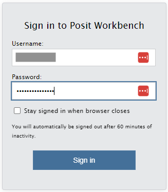
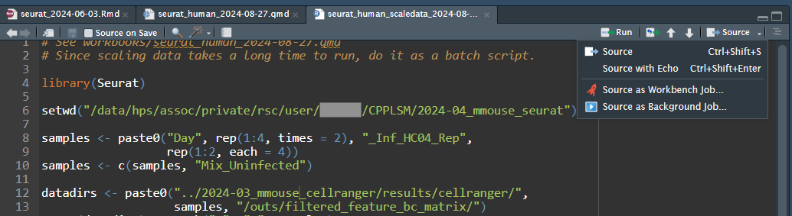
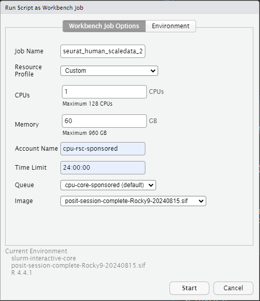
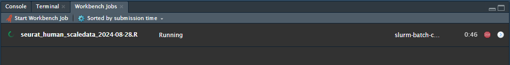
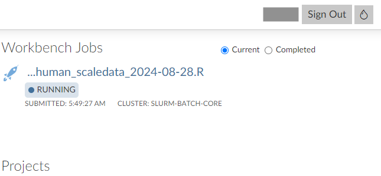

# Posit Workbench {#sec-positworkbench}

## What is Posit?

Posit, the company that made RStudio and the tidyverse, has made a platform called Posit Workbench that can run on high performance clusters such as ours. If you are working with R, Python, or any other language where you want to seamlessly go between writing code and executing it, you will find Posit Workbench to be very helpful. With it, you can launch a session of RStudio Pro, Jupyter Notebook, JupyterLab, or VS Code. These sessions are run on Sasquatch, but you interact with them through your web browser. So you get the convenience of using an IDE (interactive development environment) combined with the power of our HPC, without having to install anything on your local machine. These sessions also all run inside of a container, which for you will mean that basic amenities like having a modern version of Python or R will be present right out of the gate.

[Official Posit Workbench user guide](https://docs.posit.co/ide/server-pro/user/)

## Logging in to Posit Workbench

While on Zscalar, Citrix, or the Company network, go to our [Posit server webpage](). Log in with your Company short user name and password.



Not everyone with a Sasquatch account is automatically granted Posit access, since we have a limited number of licenses. To request Posit access, use the [Jira help desk]().

## Sessions

### Launching a session

To help you quickly get started follow this [link](Posit.qmd).

## RStudio quick start guide {#sec-positworkbench_rstudio}

**RStudio Pro** is an IDE for R and Python.  It includes a console, syntax-highlighting editor that supports direct code execution, and tools for plotting, history, debugging, and workspace management.

Below we will highlight a few key features of this tool that you you might want to know about.

### "Four panel data science"

RStudio is a highly configurable environment. But the most common arrangement is that people use it in the default "four panel" arrangement. Here is a brief overview of these 4 panels for the uninitiated:

Editor panel:

-   This pane is your code editor\
-   If you have multiple files open they will appear in separate tabs

Console panel:

-   The default pane here is the console pane which will show output from R commands and allow direct interaction with R
-   There is also a tab for the Linux command line terminal:
    -   When you first launch the terminal in a session it will load your `.bashrc` file, this may cause some error messages as RStudio will not see the module system from inside of its container.\
    -   This is normal. Feel free to ignore these whenever this happens.
-   There are also tabs for background jobs and workbench jobs - we will say more about workbench later

Environment panel:

-   The default pane here is for tracking objects that are in your different R environments
-   There are also tabs for history, and (if using version control), for git (among other fun things)

Files panel:

-   The default pane here is your file browser
-   There are also tabs to show outputs from plotted figures, help pages and even a package browser

### Some important options

One thing to think about when you launch a new RStudio session is your global options. By default, (under: Tools/Global Options/General/Workspace) RStudio will always ask you to save your workspace into a .RData file. And this can cause mischief! Especially if you regularly try things that (for example) use up all the memory and cause your system to crash. So I would actually recommend that you turn this feature off so that you are guaranteed to always have a clean session whenever you start up. It's worth looking around at the other options too. For example a lot of people like to use the rainbow parenthesis, and a lot of people will want to switch to a darker background or alter the amount of spaces in a tab etc.

### RStudio Projects

Frequently when you use RStudio, you will need to work on multiple different projects at the same time. We recommend that you use Project files (.Rproj) for that. Basically, whenever you create a new project, you will want to create a folder with your git repos checked out and then create a "New Project" file (from the file menu). After you have done that, then you can use the project selector in the upper right of the GUI to rapidly switch between projects. Each project can have it's own git repository, and will remember stuff like which files you were working on and what you were doing the last time that you were working in there.

Since most of the time you can only 'watch' one session anyways, projects are a great way to make good use of your resources (and to reduce 'cognitive load').

### Quarto Documents

RStudio makes it very easy to author quarto documents. Quarto documents are an easy way to engage in 'literate programming' which is a big fancy sounding phrase for the process of creating a single document that contains BOTH your code AND your thoughts. Quarto documents are easy to create and allow you to greatly simplify how you document your work. They are more flexible and powerful and can be rendered to make slides, documents, posters or even interactive HTML pages. Quarto documents allow users to code in most languages that are used for data science (including R, shell and Python). And while RStudio is NOT the only place where you can make these documents, it is one of the best places to do that. So we feel that you might want to have heard about it.

### Workbench Jobs

One handy feature of RStudio Pro as compared to the free version is Workbench Jobs. Is a particular step taking too long, and you would rather submit it as a batch job? Just move that step over to a plain R script (including all previous steps needed to recreate the environment, or perhaps a `readRDS` or `load` command to load in objects that you have already created), then put a `save` or `saveRDS` command at the end of the script to save the output. Then do Source --\> Source as Workbench Job...



Then select parameters for the job to run on Slurm. If you like, in the "Environment" tab you can also set a working directory, if you don't want to specify it in the script like I did in my above example.



After you start it, you will see it running in the "Workbench Jobs" tab. You can safely suspend or quit your RStudio session, and the job will continue running. Or, you can work on something else in your RStudio session while you wait. You will be able to view this same job from any RStudio project. Using the "\>" button next to the stop sign, you can see console output from the current job.



If you quit RStudio, you will be able to see the job from the main Posit Workbench page. You can click on a job for more information about it.



#### **Tips** for workbench jobs:

Once you have launched a workbench job it's natural to wonder about it while you are waiting for it to run. Here are some things you can do to check on running jobs:

-   Look at the terminal pane and use the `squeue` command to see which compute node your job is running at.
-   Also from the terminal, use `ssh` to connect to that node
-   Once you are logged into that node, you can launch tools like `htop` to 'see' what your job is doing

### Accessing conda environments from inside of RSTUDIO

Sometimes when you are using R and RStudio, it can be convenient to also access a companion python environment at the same time. This is easy to do by using the reticulate package and mamba. This allows you to not only have access to both R and Python at the same time, but you can even get access to the objects from each individual session: at the same time!

(Here I assume that you already have a mamba environment named pandas.)\
(If you want tips on that, see the section below called ["creating a custom jupyter kernel from a mamba env"](#creating-a-custom-jupyter-kernel-from-a-mamba-env))

If you want to use mamba for your python environments, then you will need to 1st tell R about where it is that you have installed that.

So for this 1st part, you will need to learn where your mamba is installed. To find out, open a terminal and use the following command:

```{bash, eval=FALSE}
whereis mamba
```

That command will print out the path for your mamba installation. (e.g. `/miniforge3/condabin/mamba`)

Once you know the location of your local mamba install, you can use reticulate with conda by just telling R about it. To do that you just need to run a command like the one below inside of an R code chunk before you start to try and use conda. The command below sets an environment variable in your R session to help R know where your mamba is installed.

`Sys.setenv(RETICULATE_CONDA="/miniforge3/condabin/mamba")`

**Note**: you can set this up each time you launch R by using the [~/.Renviron](#renviron-file).

Once you have done that, you can use reticulate:

```{r,eval=FALSE}
library(reticulate)
## this will work as long as you have a mamba env called 'pandas' created.
use_condaenv('pandas') 
## once you have called use_condaenv(), any subsequent 'python' code chunks will draw from that specific environment
```

#### Your R and Python objects are shared across **both R and Python** within RStudio:

As you run code chunks and create objects in R and Python within your quarto documents you will notice they will both populate in different parts of the Environment pane.

And not only that, but you can access R objects that you have created within your python code chunks by typing `r.<object_name>`. And similarly, you can also access python objects you have created within your R code chunks by typing `py$<object_name>`. The result is that both languages can have access to the data and objects from the other language in a pretty seamless manner.

The topic of reticulate is actually quite a big one as the library has a LOT of additional functionality, but this should be enough to get you started using it on Sasquatch. For more detailed information about how to make use of Reticulate, please see [this short reticulate guide](https://rstudio.github.io/cheatsheets/html/reticulate.html), which can show you several more examples that you can play with.

### Using GPUs inside RStudio

See @sec-usinggpus_rstudio.

## Jupyter quick start guide {#sec-positworkbench_jupyter}

**JupyterLab** is a web-based interactive development environment (IDE) for notebooks, code, and data. Notebooks are the core abstraction of JuptyerLab.  They are a shareable document that combines computer code, plain language descriptions, data-rich visualizations, and interactive controls.  Notebooks support over 40 programming languages -- we currently support Python and R.

### creating a custom jupyter kernel from a mamba env

First lets briefly talk about how to make an environment. The best way to do that is to make a little `pandas.yml` file the file should look like this:

```         
name: pandas
channels:
  - conda-forge
dependencies:
  - python
  - pip  
  - pip:
    - pandas
    - jupyterlab
    - ipykernel
```

The **MISSION CRITICAL** part of the environment described above are the last two lines where we make sure that we install `jupyterlab` and `ipykernel` package. Those dependencies are what are going to allow us to register this environment in the subsequent steps.

To actually convert our `pandas.yml` file into an actual environment, run the following command from the Command line:

```{bash, eval=FALSE}
mamba env create --file pandas.yml
```

The approach here, where we use a file to make our environment is considered 'best practice', because it gives you a record of what is in your environment. Also, if your coworkers want to create the same environment, you can simply share the file with them.

Now that you have an environment created which has the ipykernel package installed, you will need to activate that environment (on a command line) like this:

```{bash, eval=FALSE}
mamba activate pandas
```

And then (inside our new env) you will need to register the kernel like this:

```{bash, eval=FALSE}
ipython kernel install --user --name "pandas"
```

(The `--user` part of this command will only register a kernel your individual user.)

After you have done so, your Jupyter session should be able to find the registered kernels and you should be able to switch to them using the kernel selector in the upper right of the GUI

Note: VS Code will do this kernel setup for you in your existing mamba environments and is a much easier way to get setup with just the Python and the Jupyter Extension installed.

### Using GPUs inside Jupyter

See @sec-usinggpus_jupyter

## VS Code quick start guide {#sec-positworkbench_vscode}

**Visual Studio Code** is in an IDE that supports almost every major programming language -- we currently support Python and R. It's very full-featured and it's capabilities can be expanded and customized through an expansive selection of extensions. For a recommended list of extensions in this environment, please see this [page from the Posit Users guide](https://docs.posit.co/ide/server-pro/user/2024.04.1/vs-code/guide/recommended-settings-and-extensions.html).

### Using GPUs inside VSCode

See @sec-usinggpus_vscode

## Resources for learning R and Python

Research Scientific computing offers several courses on R and Python, with the introductory courses being offered about once per year:

-   [R for Biologists](#)
-   [Data Visualization in R](#)
-   [Tidyverse for Data Science](#)
-   [Python for Biologists](#)
-   [Exploratory Sequence Analysis in Linux and R](#)

Additionally, there are many external online resources available. We recommend that you try the Carpentries, all of their course materials are free and aimed at scientists and other academics who are new to coding.

-   [Intro to R and RStudio for Genomics](https://datacarpentry.org/genomics-r-intro/)
-   [R for Reproducible Scientific Analysis](https://swcarpentry.github.io/r-novice-gapminder/)
-   [Data Analysis and Visualization in Python for Ecologists](https://datacarpentry.org/python-ecology-lesson/)
-   [Plotting and Programming in Python](https://swcarpentry.github.io/python-novice-gapminder/)
-   [Programming with Python](https://swcarpentry.github.io/python-novice-inflammation/)

## What if I want to use the SAME R and Python as is provided for these IDEs?

Unless you have deliberately set up a mamba environment or something to create a custom environment, then the R and Python you will have access to in these IDEs will be the same as what is in the .sif file whenever you launch a session. So if you want to use these same containers to separately run a slurm job you can do that by just launching that job inside one of these same containers. The containers that are available by the Posit IDE's can all be found at this path here:

``

-   The image that named `` is the "base" image. This is the default Posit image that all the others here are likely to be based upon. If you have trouble installing an R package with the base image, please reach out to us. You might find that we are already looking into further enhancements that match what you are looking for, but even if we aren't that doesn't mean that we won't want to hear about what you need.

-   You may also see other images in that directory that have been customized for special uses for other users. Unless you know what these are, they seem unlikely to help you out.

If you are curious what is inside the image, you can inspect the image using `apptainer inspect`:

base image:  
`# quite a complex recipe`
```bash
apptainer inspect --deffile /
```
