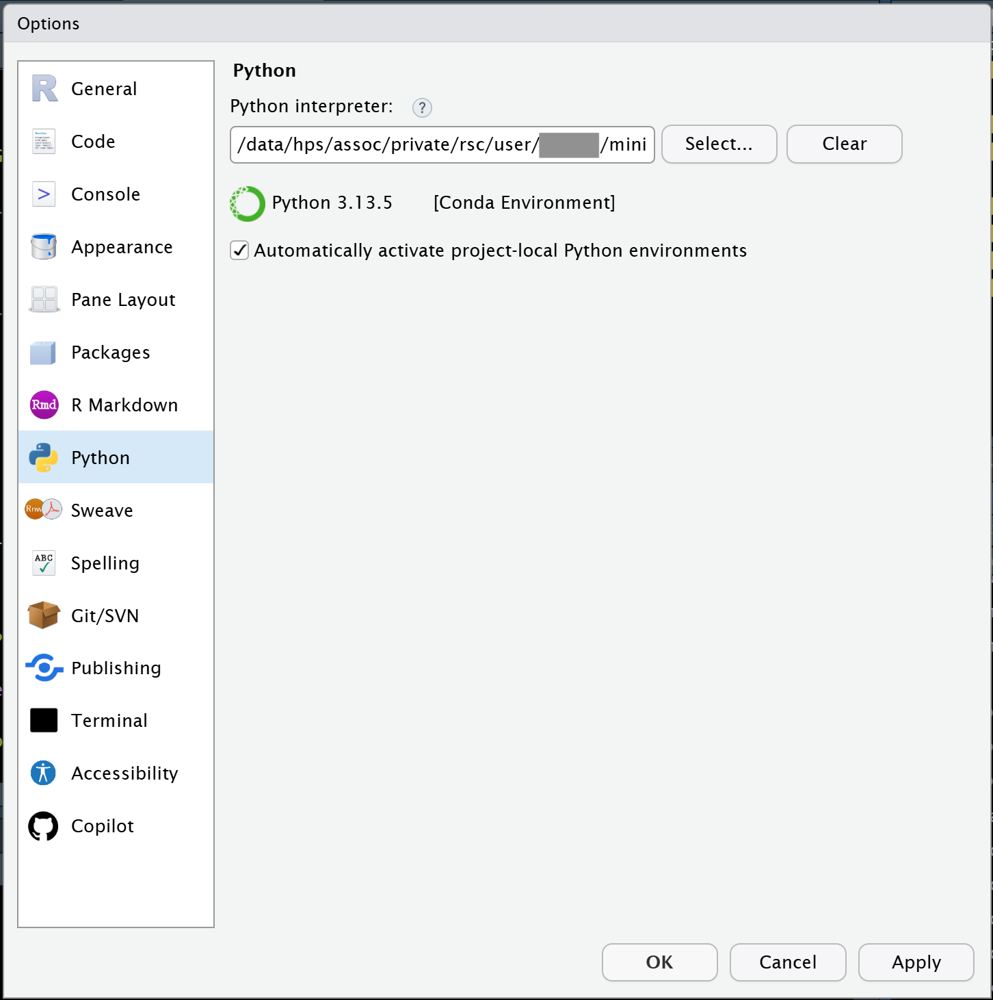

# Using GPUs {sec-#usinggpus}

## What is a GPU?

GPUs are specialized co-processors that allow for very large numbers of mathematical operations to be performed in parallel. Initially developed to help with rendering 3D graphics in videogames, GPUs have more recently become a preferred tool for running the massive amounts of computations needed by machine learning and AI applications. Many GPUs today are heavily specialized for use with AI and ML, and these are the kind of GPUs that we have on Sasquatch. In fact, because of the recent emphasis on AI use cases, some of the newest designs are even re-branding to be called other things like "TPU". But even for those, the core idea is still essentially the same, it's still a specialized co-processor that can do a lot of math in parallel.

There are many kinds of computations that can be accelerated with the use of a GPU. Today, a lot of tools, pipelines and packages have been written such that they can take advantage of GPUs. And on Sasquatch we have several nodes that are equipped with very powerful GPUs. But not every piece of software will even benefit from using GPUs, and of those that *can* benefit, not all software is written such that the GPU will actually be used if it is present.

Below I will try to address the important questions you will need to answer in order to be successful.

## Do you need to use a GPU?

A lot of software runs just fine on a CPU, and not everything you want to run will even benefit from being GPU accelerated. If you find that your code runs fine without a GPU, then you should probably just consider yourself blessed and save yourself the time of thinking about the rest of this section.

## Will the software I want to run actually leverage a GPU?

The next important question is whether or not the code you want to run can take advantage of libraries that already can speak to a GPU. A lot of software just has not been written to access or take advantage of GPUs. Right now, the situation for scientific software (especially in biology) is mixed. There *is* a lot of software that can take advantage of GPUs, and there is a LOT of software that cannot. The overall landscape is changing almost daily.

But if the software or libraries you want to use are not already set up to use GPUs, then the difficulty of using a GPU is going to be significantly increased. It's not impossible to do this, but it is a whole project to fix a deficiency like that, and so you should plan accordingly should you find yourself in that situation.

The good news is that for most people who really *need* to use a GPU, the software that they want to use will probably already support that. If you are not sure, you should read the documentation about the software or libraries that you want to use (or check with an AI LLM assistant like Gemini). For most tools and libraries in a well established space, it will only be a matter of knowing about the appropriate arguments.

## How do I access the GPUs on the HPC cluster?

On Sasquatch we have several ways that you can use the GPUs. The most common is probably to use them in a batch script, but we ALSO support using them in an IDE so that you can write and test your code before trying to run it *at scale*.

Here I will go over how to access these resources for each case, and I will give some examples using Python because 1) Python is the language most likely to be able to take advantage of GPUs right now and 2) Python requires a little extra setup in some cases, and so it's better to use it as an example so that we can make sure that we don't leave anything out.

## Using GPUs in a batch script

This is likely to become the most common way that people will use GPUs on the cluster. But even here, the *details* will vary from one person to the next. To make this work you will need to think about several different "layers" where you will need to specify your desire to use GPUs on the supercomputer. So lets talk about these different "layers" and what needs to be considered at each.

**Layer 1: The script**

Is your software configured to use a GPU?

Whatever software you intend to run (here I am assuming that it will probably be written as a separate script), will need to use whatever arguments or configurations etc. are needed in order to take advantage of a GPU. Often this means using an argument, and other times it may involve configuring a special object or file. If you are not sure whether you have this part sorted out yet, then we recommend that run your code in an IDE first (see instructions for this below) to make sure that it all works as expected.

**Layer 2: The scheduler**

Does your script request a GPU from the scheduler?

Check your script to make sure that you requested the resources that you need for it run. When you launch your sbatch script using slurm you will need to include arguments at the top to tell slurm that you need access to gpu resources. These may include arguments about how many gpus you will want to use as well as which gpu accounts to use for submitting the job. You can see these and other details about slurm jobs in @sec-submittingjobs.

**Layer 3: Dependencies**

Does your code have access to all of the libraries it needs while running?

The easiest way to do this is to use a container. And the easiest container to use is probably the same ones that we build and maintain for the IDE. These containers have been built to support the latest cuda libraries so they should have what you need already in them. But even if you use these containers, you will still need to make sure that your container launches using the `--nv` flag like the example below:

`apptainer exec --nv --bind /data/hps/assoc /data/hps/assoc/public/bioinformatics/container/posit/posit-base-20250605.sif python <path/to/script.py`

If you don't use that container, then you will probably need to build a container that has all the correct cuda drivers etc. built into it. You can do this if you want to, but it's a whole task of it's own.

**An Example script to consider**

Below is an example script using the software CellBender, which has an option to use GPUs. As an added bonus, this is an array job, so that all samples can be processed in parallel. A CSV is used, listing sample IDs in the third column.

``` bash
#!/bin/bash

#SBATCH --partition=gpu-core-sponsored
#SBATCH --account=gpu-mylab-sponsored
#SBATCH --ntasks=1
#SBATCH --cpus-per-task=6
#SBATCH --mem-per-cpu=7500M
#SBATCH --gpus=1
#SBATCH --time=24:00:00
#SBATCH --mail-type=ALL
#SBATCH --mail-user=mickey.mouse@company.org
#SBATCH --chdir=/data/hps/assoc/private/mylab/user/mmouse/logs
#SBATCH -o cellbender-%A_%a.out
#SBATCH --job-name=cellbender
#SBATCH --array 1-20

cd /data/hps/assoc/private/mylab/user/mmouse/awesomeproject/results

IDENT=`head ../samples/sample_bookkeeping.csv -n $SLURM_ARRAY_TASK_ID | tail -n 1 | cut -d , -f 3`

echo $IDENT

mkdir -p cellbender/$IDENT

apptainer exec \
--nv \
--bind /data/hps/assoc/mylab/user/mmouse/awesomeproject/results:/mnt \
/data/hps/assoc/mylab/container/cellbender_0.3.0.sif \
cellbender remove-background \
--cuda \
--input /mnt/cellranger/$IDENT/outs/raw_feature_bc_matrix.h5 \
--output /mnt/cellbender/$IDENT/output.h5
```

In the above example, take note of:

-   The `SBATCH` header: `partition`, `account`, and `gpus`.

-   The `apptainer` command, with the `--nv` flag to give the container GPU access.

-   The `cellbender` command, with the `--cuda` flag to tell it to use the GPU.

## Using GPUs with RStudio {#sec-usinggpus_rstudio}

Yes you can run your Python code from RStudio. And it basically works right out of the box. Here is what you will need to do:

**Step 1: Set up an environment for Python**

When using Python, we recommend that you create a mamba environment that has your Python flavor along with all the libraries that you intend to use etc. You can see how to do this by referring to @sec-mamba.

**Step 2: Launch RStudio using an environment that has a GPU**

How to do this step is detailed in @sec-positworkbench_rstudio.

**Step 3: Tell RStudio about your environment**

Under the `Tools` menu, you will want to select `Global Options` and then click on the `Python` tab on the left side. Then click the `Select` button and tell RStudio which Mamba environment you want to use.



## Using GPUs with VSCode or Positron {#sec-usinggpus_vscode}

Both VSCode and Positron are similar here as they both are based on a common open source codebase.

**Step 1: Set up an environment for Python**

When using Python, we recommend that you create a mamba environment that has your Python flavor along with all the libraries that you intend to use etc. You can see how to do this by referring to @sec-mamba.

**Step 2: Launch VSCode using an environment that has a GPU**

How to do this step is detailed in @sec-positworkbench_vscode.

**Step 3: Create a .env file next to your code and then 'open' that folder**

The `.env` file is just a text file that can specify things about your environment for VSCode or Positron. In this case, these IDEs will both try to 'sanitize' your `LD_LIBRARY_PATH` variable. And that is a problem because we need for your LD_LIBRARY_PATH to point to the installed cuda libraries. To correct for this, you need to add the following to your `.env` file:

`LD_LIBRARY_PATH=${LD_LIBRARY_PATH}:/usr/local/cuda-12.8/lib64:/.singularity.d/libs`

Then (once you have created that file), you need to open the folder that contains that file along with your code etc.

## Using GPUs with Jupyter {#sec-usinggpus_jupyter}

Jupyterlab and Jupyter Notebooks should both work so long as you have registered the kernel that you want to use.

**Step 1: Set up an environment for Python**

When using Python, we recommend that you create a mamba environment that has your Python flavor along with all the libraries that you intend to use etc. You can see how to do this by referring to @sec-mamba.

**Step 2: Register your kernel**

When using Jupyterlab or Jupyter Notebooks, you will want to register your kernel.

There are basically two steps. First you need to use `pip` to install the ipykernel package

`pip install ipykernel`

And then you need to register the kernel like below. Be sure to replace `<kernel_name>` with the name of your environment in the example. Note that while the `--display-name` argument is optional, you will probably want to also customize that string too.

`python -m ipykernel install --user --name <kernel_name> --display-name "Python (<kernel_name>)"`

**Step 3: Launch JupyterLab using an environment that has a GPU**

How to do this step is detailed in @sec-positworkbench_jupyter.

## How can you know if your GPU is properly accessed within the notebook?

So from the discussion above, you have probably gleaned that there are many ways to launch a notebook or quarto document within an IDE and still NOT have GPU access. Even worse, most tools that support GPU will simply fall back to using CPU if they cannot find a suitable GPU, which can make this kind of issue hard to detect.

So how can we know if it's working?

Many folks will probably be tempted to run commands that will launch the nvidia CLI tool like this:

`!nvidia-smi -L`

But unfortunately this is not an ideal test in most cases, because that command actually sends the instruction (and runs it) out in the shell, which is usually a different environment than what runs in the code chunks. This means that it is not only possible but it is actually quite easy to get into a situation where your GPU is seen by the shell environment but NOT seen by the code running inside of the kernel itself. And so if that were to happen, then you would have a false positive here.

So all of that basically means that you will want to call something from WITHIN the kernel environment that is running inside of your code chunks. This means using tools that call the gpu while staying within the language of choice.

### Here is an example for how you could test that if you were using the `torch` library from python:

`import torch`

`torch.cuda.is_available()`

### And here is an example if you are using `tensorflow` package from python:

`import tensorflow as tf`

`tf.test.is_gpu_available(cuda_only=True)`

### And, lets even look at how you can set up and test the R package for `torch`.

So this one has a trick you will want to know about for the setup. Our IDE container has the very most recent version of cuda drivers (12.8), however the R `torch` package is a little bit behind that in terms of what it can recognize, so you have to do this:

First install the package:

`install.packages('torch')`

Then, tell R that it actually has an older version of cuda that the package will recognize (And don't worry! cuda is backwards compatible).

`Sys.setenv(CUDA = "12.4")`

Next, install the libtorch libraries with this command:

`torch::install_torch()`

And then you may also need to restart R afterwards. But then you should be able to test if your GPU is found with code like this:

`library(torch)`

`cuda_is_available()`

Depending on what you are doing, you will obviously want to use a test that is appropriate for your specific libraries and language of choice. And we can't really list all possible things here. So hopefully, the examples that we gave you will be enough so that you can understand what is required.
