# Using git {#sec-usinggit}

## What is git?

Imagine you're working on a very important research project, and you're constantly making changes to your code and data files. Git is like a powerful time machine for your project files. It meticulously tracks every change you make, allowing you to easily go back to any previous version, compare different versions, and even work on experimental features without messing up your main project.

Beyond that, Git is also a fantastic collaboration tool. It allows multiple people to work on the same project files simultaneously without overwriting each other's work. It provides mechanisms to merge everyone's contributions seamlessly, making it indispensable for team-based scientific computing and software development.

At our institution we have access to an internal git repository called 'Bitbucket'. Think of Bitbucket in the same way you might think of GitHub, except that it's entirely internal to the organization. The fact that Bitbucket is internal only should help you have a little extra piece of mind about what you may have accidentally put in all of those late-night checkins. Anyhow, in this document, we will talk about git and how to use it with the local bitbucket so that you can make use of this powerful tool for your own projects.


# Setup

## SSH keys

You will want an SSH key so that your Sasquatch account can talk to your Bitbucket account without having to constantly validate everytime you communicate to the server. If you don't already have one setup, please go to [Using SSH keys](UsingSSHKeys.qmd) and create one.

Now go to <https://company.domain/dashboard> and log in if necessary. Click on your picture in the upper right, and then choose "Manage Account".

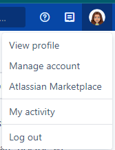

The GUI will look a bit like below, and you can then follow the instructions that are found on the SSH Keys page called [Integrating with Bitbucket/Git](UsingSSHKeys.qmd#integrating-with-bitbucketgit)

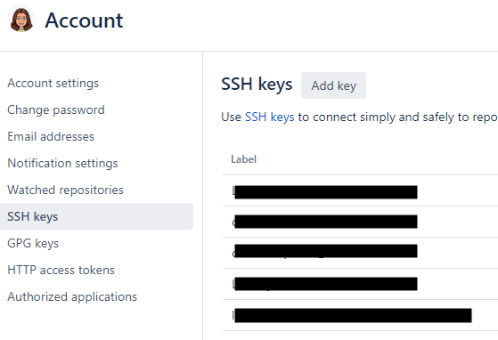


# Making a new Bitbucket repository

In the upper right, click your image again, and click "View profile". Click the button to create a repository.

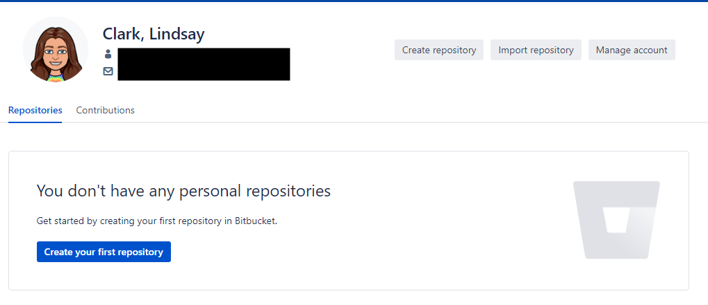

Git the repository a name and description, the default branch name should be set to "main".  Don't change it.

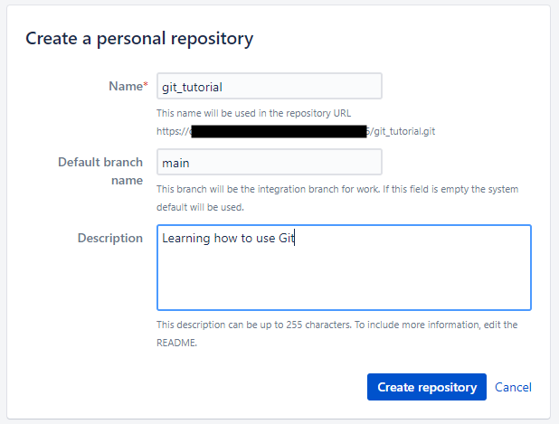

Click "Create repository", and you should be taken to a page with some helpful instructions. 

**I recommend that you NOT leave this page until you have followed the instructions**  

These instructions are to help you get your "local copy" of the repository set up (so 
I recommend that you keep them handy until we are done with the next section).


# Cloning your repository

Now, at this point you might be wondering: what do I mean by "local copy"?  Didn't we just set all of that up?

**Git always wants to exist on at least two levels:**

    1) The bitbucket server that stores the main copy of everything

    2) All the 'working copies' that live in the directories of the users who have access 

At this point in time, you will already have set up the main copy (This is where bitbucket/git can coordinate changes made by different team members etc.)

But now you still need to configure at least one "working copy" (where you will do most of your work)


If you followed the instruction from Bitbucket in the previous section, then you won't need to do these steps again.  But lets talk about them so that you understand what is happening...

We previously created a repository on Bitbucket, but to make a copy on our own file system we still need to 'clone' it. 

But before we can clone our repository you will want make a decision about where you want your local files to live.  Once you have done that go to the command line and navigate to the directory where you will want to configure and store the local copy of your repository. If you have created some files there already, you will get a chance to add them to the repository soon...

The next step is that you will need to configure git to know what your name and email address are. In the Terminal, you will want to run some commands like these ones, putting in your own name and email.  These commands just allow git to store this information for you so that you don't have to type it in every single time that you go to do a commit.


```bash     
git config --global user.name "Doe, Jane" 
git config --global user.email "Jane.Doe@company.org"
```

Next up is the actual cloning.  If you don't have anything in your repository, then you will get a message that says you have cloned an empty repository the 1st time that you clone it.  The following is just an example so that you can see how this command might look.

```bash
git clone ssh://git@company.domain:7999/~jane.doe_company.org/git_tutorial.git
```

If you have a couple of files you want to put into the repository then you might want to copy them into your new repository directory, then 'add' them, 'commit' them and 'push' them.  We will talk more about these important steps in just a moment, but for now lets just describe them as we consider using them for the 1st time.

Adding files tells git that you care enough about the file that you want it to be tracked by git and eventually stored in the repository.  Some files are just generated files so not every file will qualify for being tracked in this way.

```bash      
git add --all
```

Committing files tells git that you want to save any changes to the file.  Committing is only a LOCAL save however.

```bash      
git commit -m "Initial Commit"
```

When you have saved a stack of commits and you are ready to preserve those changes back up to the main repository in bitbucket, then you will want to "push" the changes up.  However the below command *also* specifies where you are pushing to.  Git will remember where to push files to after you have told it once in this way so the next time you should only have to say `git push`.

```bash      
git push --set-upstream origin main
```


## Meanwhile back at Bitbucket

Now, back on Bitbucket, if you hit the "Refresh" button on your repository, you will be able to see what you currently have.  So for example, you will be able to see any files that you added, committed and pushed in the previous steps.

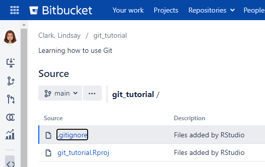

Provided that you have been following along, the data that is up on the bitbucket site should now be in sync with the 'local' copy of the data on Sasquatch.  If it isn't it probably means that you need to make sure that your files are in the cloned directory, and have been added, committed and pushed.  And that brings us to our next topic...


# Your regular workflow: save, diff, stage, commit, push

The normal set of operations you will use with git involve the 5 commands above.  It might seem complex at first, but each of these commands has its own purpose.  These are all separated from each other for a reason.  Here I am going to go over these different commands so that you have a high level overview of the stages that you will normally step through, and then later we will look at examples for the specific commands that are used for these stages.

So let's describe these stages:

1.  `save`: Save the file. Git can't see anything that you haven't saved.  This is not an official git operation, but it **is** a requirement.

2.  `diff`: Review the diff.  `diff` is a powerful tool that is bundled with git to let you see differences between your current file and the state of your file in either the past or in other versions of the repository (perhaps as edited by others). In this way you can confirm the changes that you have made, and ensure that there was no "feline-assisted" typing.  Not to disparage our feline friends, but they are not famous for their coding prowess.

3.  `stage`: Stage the file(s). This tells Git that you are ready to check in the changes that you have made.  After a file is saved, you can use the `add` sub-command to tell git that you want to stage the file.  And if you have forgotten, you can always use `status` to see which files git is expecting to include in the next commit.

4.  `commit`: Commit the changes. This marks a set of changes as having all been for a certain reason (described in your commit message). It also makes a snapshot of your entire repository, and you can roll back to this snapshot at any time in the future.  By default, git will `commit` the files that it has `stage`'d, however you also have the option to be more granular and only `commit` some of the files.  Think of `commit` as a way to make a snapshot of the repository that you can return to at a later time.  It's like a 'save' feature, but on steroids.

5.  `push`: Push the commit(s). This uploads all of the commits (since your last push) into Bitbucket. You don't have to do this after every commit, but it's a good idea to do it at least once a day.  If you have not done a push, then your local copy is the only record of what you have been working on, so this is an important step.

<!-- TODO: consider adding image of example workflow -->

After you have run through the steps above you will be able to refresh what you see on Bitbucket. When you do that, not only will you see the new files, but each of your commits will be stored as a separate checkpoint on a vertical "timeline" within the interface. You can browse your history on Bitbucket as well by clicking the "commits" icon on the left.

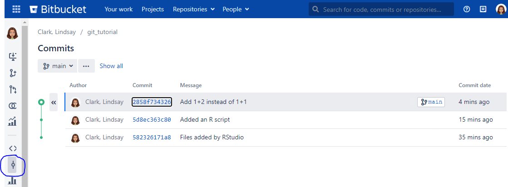


# Ignoring files

Some files are not worth putting into git.  Consider the following example.

Imagine that you had the following code within an R script in your repository:

```r      
dir.create("results")
data("iris")
library(ggplot2)
ggplot(iris, aes(x = Sepal.Length, y = Sepal.Width, color = Species)) +  geom_point() ggsave("results/sepal_scatter.png")
```

Now if you were to execute the code, it will have created a "results" folder with a .png image in it.  And if you then look in your directory or use tools like `git status`, you would always see the results folder in the list of things that you might want to stage.  But, you won't want to add those files to your repository for tracking.

Why shouldn't you commit that .png file? For one, it is a binary file, so although Git can track changes to it, it can't show you those changes in any human readable format. Secondly, your script is completely sufficient to reproduce this figure should you lose your original copy.

But you don't want it cluttering up your list of untracked files in Git. You would rather tell Git to ignore it. To do this, just create a file called ".gitignore". And then to that file, add the following line:

```bash        
*.png
```

This will prevent ANY .png files from ever getting noticed by git (or suggested for staging), to make this permanent you would want to `commit` your changes to the script and to .gitignore.

Some bioinformatics programs will output large text files. Let's simulate that with some more code in our R script.

```r        
cat(runif(1000), file = "results/big_output.txt")
```

We can ignore files like this by adding `*.txt` to our .gitignore. 

But wait, we do want to track README.txt! 

Fortunately, there is a solution for that too.  We can get around this problem by using an exclamation point (`!`) in front to indicate any things that we want git to NOT ignore. And in fact, I can even use an asterisk along with the exclamation mark to make sure I keep anything starting with "README". So you can add these two lines to your .gitignore to accomplish this:

```bash      
*.txt
!README*
```

And from then on, when you go to commit, you should only see your script and the .gitignore.

Note that there are a couple of alternative approaches that you could also consider. You could just add `results/*` to your .gitignore to ignore everything in the results folder. And you could also give the results folder its own .gitignore file.

What should you ignore vs. track?

-   Anything bigger than a couple Mb will slow down Git, and should be ignored.

-   Large input data files aren’t going to be modified anyway. Just keep them in a safe location and ignore them in your git repo.

-   Git is only useful for tracking changes to plain text. It will track changes to binary files, but the diff won’t mean anything to a human. Images, PDFs, Word/Excel/Powerpoint files should generally be ignored, unless they are small and you want to use Bitbucket to share them with collaborators.

-   If your scripts are 100% sufficient to reproduce the results (which they should be), you can ignore results files.

-   All code should always be tracked.

-   Notes and documentation are best kept in plain text, Markdown, RMarkdown or Quarto so they can be tracked with Git. If you use Markdown, it has the bonus of rendering nicely on Bitbucket.

-   Tab-delimited text files or CSVs containing sample metadata should be tracked. These files are small, text format, and provide very useful context for understanding your experiment. Plus, you might want to track changes, for example if you find an error in the metadata or if you need to make a column of notes about samples.

# What makes a good commit?

A commit can be a typo fix in a single line of code. It can be a new function definition spanning 200 lines. It can involve a single file or many files. But here’s the most important thing. You should be able to describe the reason for your commit in 48 characters or so. All the changes in one commit should have been made for the same reason. If it’s your first commit and you are adding a bunch of files that you have already been working on, “Initial Commit” is fine for a commit message. Otherwise try to keep it fine grained.  Each commit acts as a 'checkpoint' that you can roll back to, and if you should find that you need to roll back, you will benefit from having made several small commits instead of one or two very large ones.

As an experienced coder, I would even say I rely on my emotions to know when to commit. If I find myself thinking, "Yeah, I finally got this thing to work!" then it is time to commit. If I think "This way might work, but I think I should delete it and try a different way" then it is also time to commit.

I will frequently be making one set of changes, then get distracted and see something else that needs to be fixed. That’s fine. Even within one file, I can split the changes into multiple commits. You can fine-tune these even more with `git add -p` on the command line.


# Examples of git commands in action

## Status

The `status` command mostly is used to tell you which of the files that git is tracking have changed since your last commit.  So if you type:

```bash
git status
```

and then hit enter. You may see something like the output below.

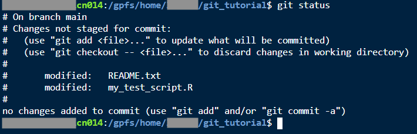

You can learn several valuable things from `git status`:

-   What branch you are on

-   What files have been staged

-   What files have been changed, added, or deleted, but not staged yet

-   How many commits have been made but not pushed yet


## Diff

The `diff` command is usually used to compare your current file to some past commit. So a command like:

``` bash
git diff my_test_script.R
```

Will show you what has changed with `my_test_script.R` since the last commit.

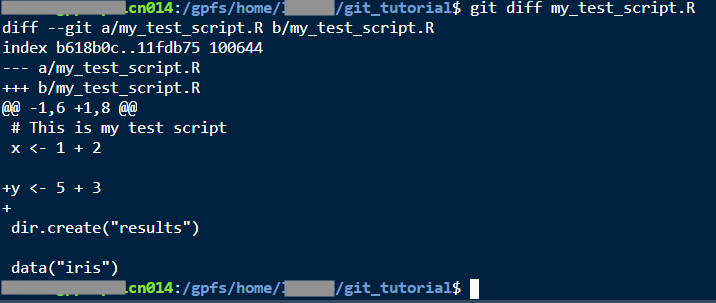

Under the `@` signs, you will see code that changed, surrounded by unchanged code for context. In this case we see + signs next to lines that were added. If we had deleted some lines, we would see - signs next to those lines.

If you insert or delete many lines, `git diff` will put its output into `less`, meaning you can scroll through it with the space bar and/or arrow keys, and press `q` to quit.

You can also use `git diff` to compare two files. Now you can find all the differences between "dissertation_analysis_final_2022-11-30.R" and "dissertation_analysis_final_FINAL_2023-01-15.R", which you made before you knew how to use Git.  If you want to practice, you can test this by making a copy of your script and call it something like "my_test_script_new.R". After copying, you will want to make some edits to the new one. And then do this:

``` bash
git diff --no-index my_test_script.R my_test_script_new.R
```

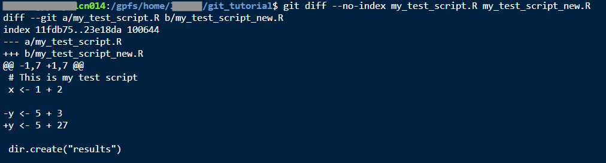


## Add

To stage files, and let git know that we want to track changes in them, we use the `git add` command. It looks like this:

``` bash
git add my_test_script.R
```
And then (after adding), you can check the status to see what will have changed:

``` bash
git status
```

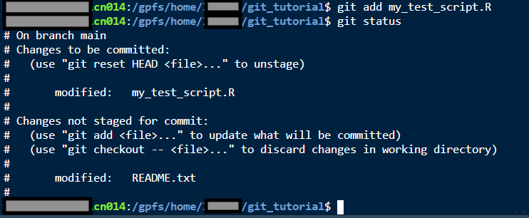

Now you can see that my_test_script.R is officially staged.

As I mentioned before, if you made a lot of changes to a file but you only want to commit some of those changes, you can do a command like

``` bash
git add -p README.txt
```

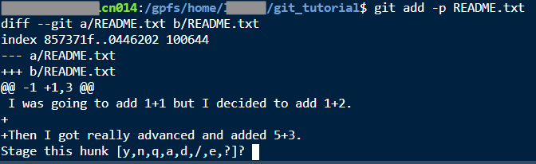

Now you have an interactive interface where you can decide what changes you want to stage. Hit "y" to stage this hunk of the file. Bigger hunks will have an "s" option to split them up into smaller pieces.


## Commit

The git `commit` command makes a commit and saves a checkpoint. You can use it with the `-m` flag so that you can add a commit message inline, or if you don't use the `-m` flat, then you can use an editor (it will open up `vi` by default) to write your message.  Either way: you will be expected to craft a short commit message.  Try to write something specific and short that reminds you of the changes in this commit.  There is a real art to writing good commit messages, and a lot of people struggle to put meaningful things in their messages.  It is a great habit to cultivate though as it can save you a LOT of effort later.

``` bash
git commit -m "Also added 5+3"
```

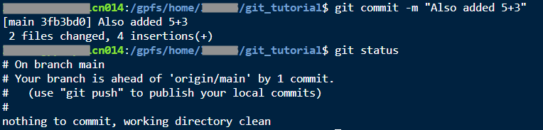

## Push and pull

The git `push` command is pretty straightforward.  This command just syncs your local copy with the original bitbucket repository. You won't generally need any other arguments unless you want to `push` a specific `branch`.  

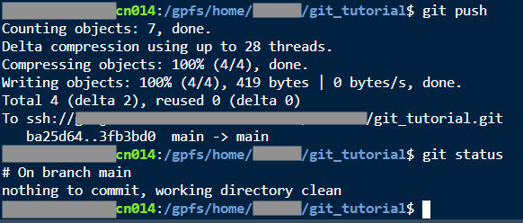

If there are changes in Bitbucket that aren't in your local copy (for example, if you have copies of the repo on multiple computers, or you are collaborating with someone else), you can also use the `git pull` command to get your copy all caught up with changes that may have been `push`'d by others into Bitbucket.


## Deleting, moving, and renaming files

To remove files from git you will need to use `git rm` to remove any files or `git mv` to move or rename them.  

> Note: Do not change the contents of the file during the same `commit` as the `mv`; if you do, git will show this as an delete of the previous named file and an addition of the newly named file instead of a proper move and may make historical comparissons harder than neccessary.  

For example, let's say I have decided I want to use Markdown, so I am going to change README.txt to README.md.

``` bash
git mv README.txt README.md
```

``` bash
git status
```

``` bash
git commit -m "Use Markdown for README"
```

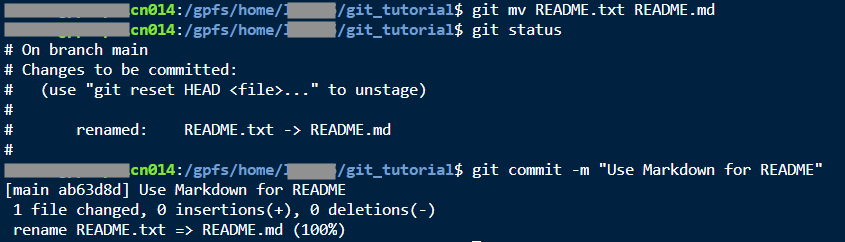

Likewise if you are tracking a file and you want to delete it, you can do something like:

``` bash
git rm file_to_remove.R
```


## Commands used when setting up local repository

### **When you don't have any code yet**

If I had wanted to clone my repository to Sasquatch, I would `cd` into a parent folder where I wanted to put it, then do

``` bash
git clone ssh://git@company-atlassian:7999/~username/git_tutorial.git
```


### **When you already have code**

If I had an existing folder full of code that I wanted to start tracking with Git, I would `cd` into that folder, then do

``` bash
git init
```

If I wanted to then manage that folder on Bitbucket, I would create a new repository (say it's called "my_big_project") on Bitbucket but not clone it anywhere. Then back in the terminal within my folder I would do

``` bash
git remote add origin ssh://git@company-atlassian:7999/~username/my_big_project.git
```

Then I would carefully curate my .gitignore, add and commit all files with a message like "First commit", and push to Bitbucket.


# Checkout

There is no "undo" for `commit`s. That might seem counterintuitive, but remember that Git is designed for collaboration, and it would get very problematic if `commit`s started disappearing when people were working on something together. If you decide that a `commit` should not have been made, you will have to make a new `commit` that reverses the changes.

But first, how do you get back to an earlier version? That is done with `git checkout`. We need to know the ID (or hash) of a `commit` that we want to check out. You can get that by looking in your `commit` history on Bitbucket, or with `git log`.

``` bash
git log
```

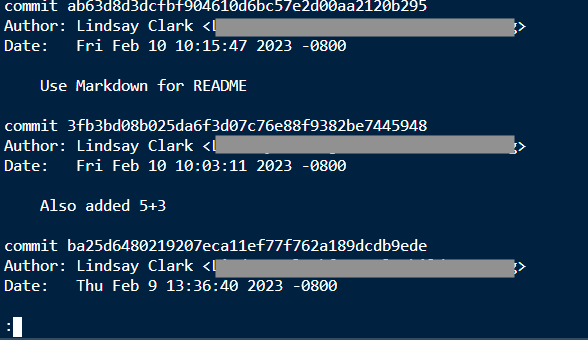

Here I have a log that I can browse with `less`. Now if I wanted to get back to before I added 5+3:

``` bash
git checkout ba25d64
```

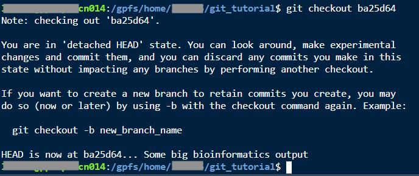

There are a lot of warnings, basically telling me that I'm going to eventually lose any changes that I make in this state. But now I can see that I have README.txt again instead of README.md, and my R script doesn't have the part where I added 5+3.

Say I decide that I really do want to roll my R script (but not my README) back to this state. Here's the delicate surgery to accomplish this:

``` bash
cp my_test_script.R ..
```

``` bash
git checkout main
```

``` bash
cp ../my_test_script.R .
```

``` bash
git diff my_test_script.R
```

``` bash
git add my_test_script.R
```

``` bash
git commit -m "Revert to before adding 5+3"
```

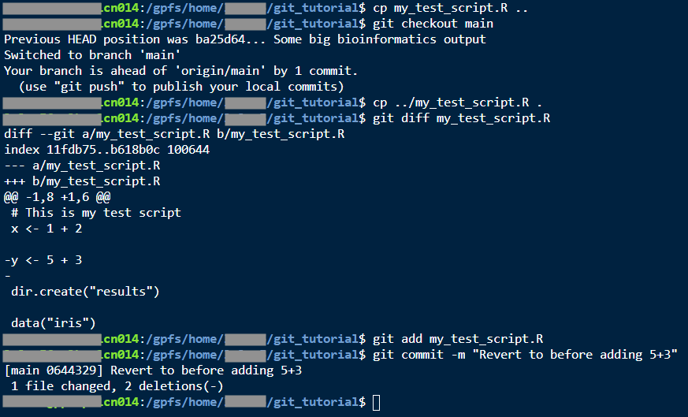

You might also want to look at the help page for `git revert`.


# Branches

Within a repository, you can have branches. These serve several useful functions:

-   Trying something out that you aren't sure you want to keep.

-   Letting multiple people work on a file at once without running into conflicts.

-   Letting collaborators on a repository review each other's work before merging it.

-   Making a snapshot of a repo at a certain point, in a way that is easier to find than browsing commits.

Push all your changes to Bitbucket, then go to your repository in your web browser. Click the "Create branch" button.

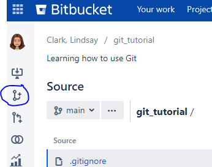

Give your branch a name and then create it.

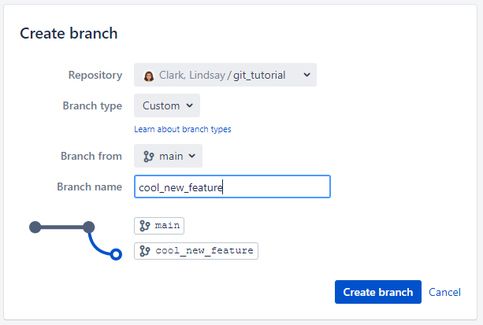

Now back in your Terminal, do a `git pull`.

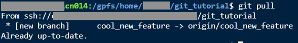

Now you can use the command `git checkout cool_new_feature` to switch to your new branch. 

> Note: if you have changes that you want to move to a new branch before you commit to the current branch, you can use `git checkout -b <new_branch_name>` and it will create a new branch and be ready for you to add your currently staged changes to that new branch. If already created a branch that you want to move changes to, you will need to use `git stash` and `git pop`, please refer to the man pages on these tools for more details.

Now make a different change to the R script in the branch, and `commit` and `push` it.

After some testing you have decided that you really like your cool new feature. You want to add it to your main branch. We will do this on Bitbucket with something called a "pull request". Click the "create pull request" button on Bitbucket.

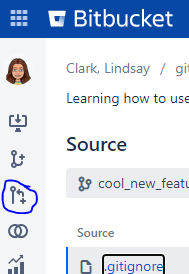

Set which branch should be the source and which is the destination.

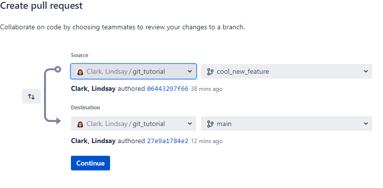

Give your pull request a description. Don't worry about reviewers just yet. 

Then click "Create".

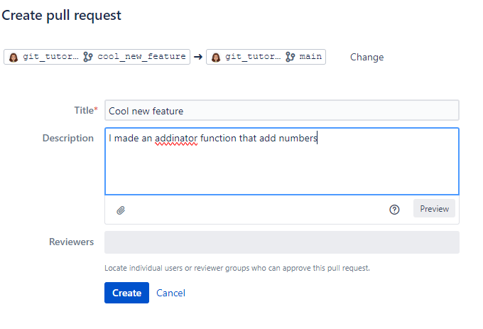

If you have a button available to merge, congratulations! You can do that and then do a `git pull` back at the Terminal. 

OR, you may have something like what I just had, where your commits conflicted with each other!

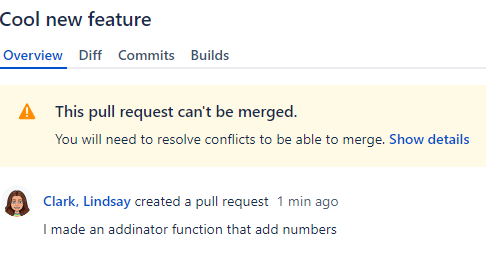

Resolving merge conflicts is one of the less pleasant aspects of using Git. 

When this happens, I basically have to go into one or both branches and make new commits until nothing is in conflict any more. 

In my case I think the issue was that I deleted a blank line at the end of the file on main, 
but did not delete that line on cool_new_feature, where I instead added some code. 

If different edits happen to the same lines of code, then merge conflicts will happen. 

I will make a commit on main to add that line back. 

As advanced as Git is, you might find yourself having to copy and paste whole lines of code from one branch into another to make the merge work.

Now that I have pushed a commit to main to resolve the conflict, I can merge.

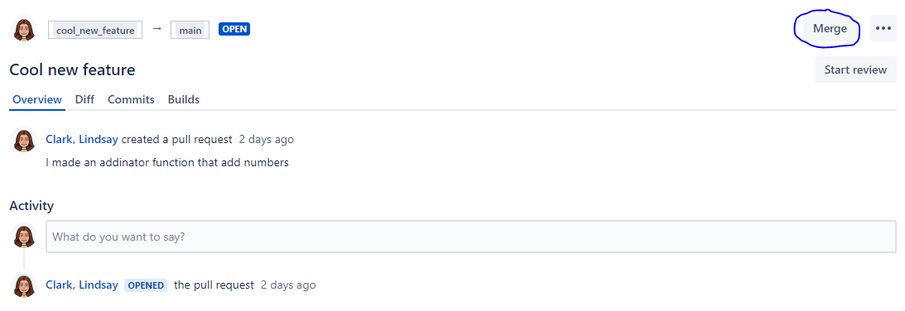

In this case, I am going to delete the branch after merging, because I don't want to accidentally start editing it again instead of my main branch.

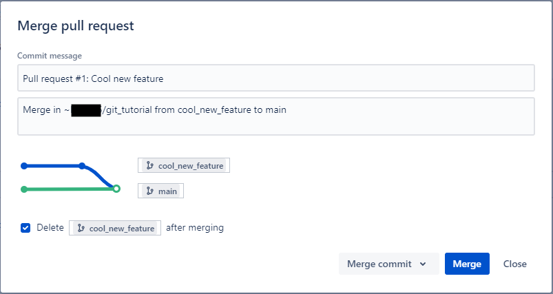


# Forks

Forks are kind of like branches, in that they are a copy of a repository at a certain point in time, and you can make changes to a fork and submit pull requests to (and from) the original. The big difference is that a fork has a different owner (or belongs to a different Bitbucket project) than the original. A fork also copies all branches from the original. So, if branches are like fingers, forks are like arms.

Here are some good reasons to make a fork:

-   Someone else's repository is read-only for you, but you want your own copy that you can modify for your use.

-   You fixed a bug in someone else's repository, and you want to suggest that they incorporate your bug fix.

-   You made a really great repository and now your PI wants a copy for the whole lab to use.

At Research Scientific Computing, we have developed several analysis workflows that are available to Company users in a Bitbucket project called RSC-products. Let's look at one of them at <https://company.domain/projects/RP/repos/rnaseq_count_nf/browse>. On the left sidebar, click the button to make a fork.

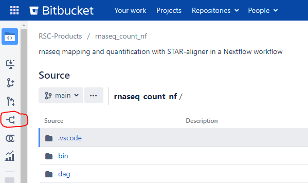

The "project" should be your name, and you can uncheck "enable fork syncing".

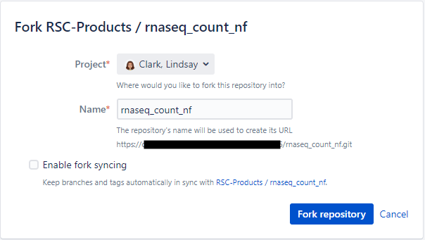

Click "Fork repository". Now you have your own copy! To get the URL needed to clone it, click the clone button. You can use that URL either when setting up an RStudio project, or from the command line with `git clone`.

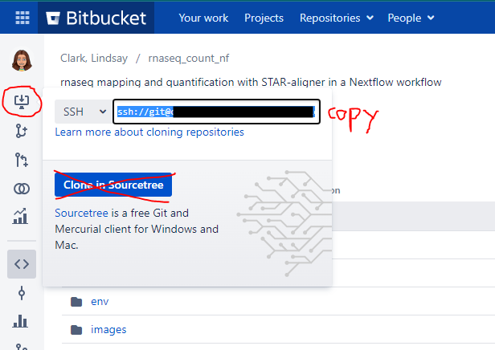

# Tips for collaborating

You can request that a Bitbucket project be set up, where you and your team members can collaborate on multiple repositories. This might be helpful for a lab where junior team members will eventually get jobs elsewhere, but you want their code to stay available. You can request a Bitbucket project at the [Jira Service Desk](#) under Bitbucket→ General Request.

In repository settings, you can add people to your repository, giving them read and/or write access. From the repository page, go to the gear icon on the bottom left. Then under "Security" go to "Repository permissions". You should see a place to add users, and a dropdown for read, write, or admin.

Always do a "pull" before starting your work for the day!


# Using git with an IDE

The better IDEs either directly support integration with git or will at least allow you to use a plugin.  

You can use git within [RStudio](https://docs.posit.co/ide/user/ide/guide/tools/version-control.html)

You can also use it with [Positron](https://positron.posit.co/git.html)

And you can use it within [VSCode](https://code.visualstudio.com/docs/sourcecontrol/intro-to-git)