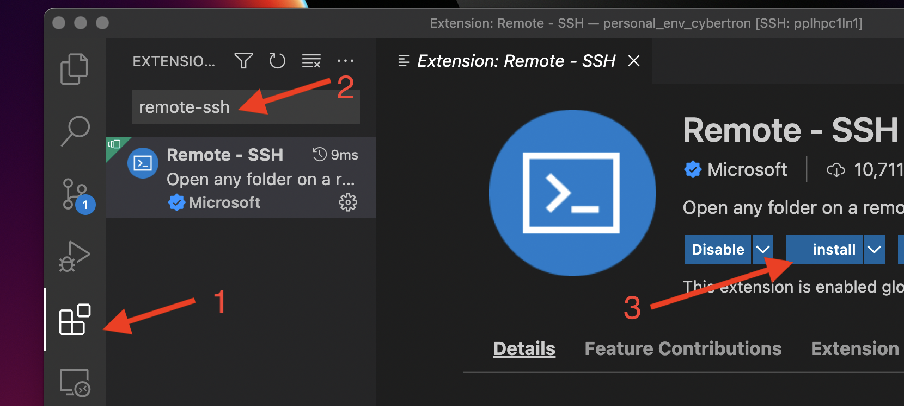

# Using Local IDEs {#sec-usinglocalide}

## VS Code

### Setting up local VS code to connect to Sasquatch

Visual Studio Code gives you access to the bash terminal, a text editor, Git, and many handy utilities, all in one program. If you are already familiar with IDEs (interactive development environments), this is a very nice one. Moreover if you desperately need RStudio in order to do your work, VS Code is not a complete replacement but should help a lot until we get RStudio on Sasquatch later in 2024.

1.  On your local PC, launch a browser and go to <https://code.visualstudio.com> to download VS Code for your operating system. Then launch the installer file that downloads. Accept the agreement and install to the default location. I like to check the boxes for putting "Open with Code" into context menus but that is up to you. Finish and launch VS Code.

2.  In VS Code, install the remote-ssh extension.



3.  If you haven't already, set up password-less login as described in [Using SSH keys](UsingSSHKeys.qmd#generating-ssh-keys-with-ed25519)

4.  Create or edit a file called `config` in your `.ssh` folder on your local computer as described <a href="UsingSSHKeys.qmd#windows_ssh_config">here</a> with the host as sasquatch: 

5.  In VS Code, open the command palette (Ctrl+Shift+P) and enter “Remote-SSH: Connect to Host” and then select "sasquatch" from the drop-down. Select "Linux" as the host platform. If everything is set up correctly, you should not need a password. It will take a minute to install things onto Sasquatch the first time you do this. Once it finishes, you should be able to open files and a terminal on Sasquatch.

6.  Do File --\> Open Folder to open a folder on Sasquatch and start working!

### Pretending VS Code is RStudio

[Posit Workbench](Posit.qmd) offers the best experience for using RStudio on Sasquatch. However, it is often convenient to be able to edit your Rscripts locally without having to log into the system. This can be done using VS Code.

I recommend installing the following extensions on VS Code while logged into Sasquatch:

-   [R](https://marketplace.visualstudio.com/items?itemName=REditorSupport.r) from REditorSupport
-   [Tiff Preview](https://marketplace.visualstudio.com/items?itemName=analytic-signal.preview-tiff) from Analytic Signal Limited

Once the R extension is installed, you can create or open an R Markdown document and it should have proper syntax highlighting. You will see some nice buttons that say "Run Chunk", but sadly these don't work. We will be launching R from the terminal and then copying and pasting our code in.

I recommend opening a tmux session on the terminal so you don't lose your work if you lose your connection (see the Quick Start Guide for brief tmux instructions). Once you are in a tmux session, do `srun` (specifying the resources you will need) to launch an interactive session on a compute node. Then launch R via Apptainer using one of the following images:

-   Standard R Apptainer images: `/container/R`

-   Posit workbench images: ``

-   You are free to download or build one of your own

``` bash
tmux new -s myawesomesession

srun -p cpu-core-sponsored -N 1 -n 1 -c 1 --mem=32g --time=10:00:00 -A cpu-mylab-sponsored --pty bash -i

apptainer shell \
--bind /myexperiment:/mnt \
/container/R/bioconductor_docker_RELEASE_3_19.sif

cd /mnt

R
```

Voila! You are at the R prompt. You can install packages from here like you normally would, and they will be put in your home directory on Sasquatch. You can also read and write files to your home directory and to any directories that you have mounted (see the `--bind` option above for mounting).

You don't have an Environment pane, but remember you can do `ls()` to see a list of objects in your environment, and `str()` to examine individual ones. If you use `?` to pull up a help page, it will get opened in the terminal in a `less` window.

Lastly, plots. I haven't found a way to get them to pop up in an X11 window, but we can write them to files on Sasquatch then look at them in VS Code.

```{r, eval = FALSE}
tiff("/mnt/figures/bestplot.tiff", compression = "lzw", res = 200,
     width = 7 * 200, height = 6 * 200)
plot(1:10, 1:10, main = "This is a plot")
dev.off()
```

After the file is made, in the Explorer pane right click on the file name and select "Open With...", then in the dropdown that appears select "Tiff Preview". The file should open in a new tab in VS Code.

### Configure ssh session to stay alive

You may notice that your ssh session gets disconnected after a period of inactivity. If this happens, you can change the behavior, such that your connection is kept alive for an indefinite period of time.

If you are on a Mac or on Linux, work in a local terminal window. In MobaXterm start a local terminal from the home screen. Do not connect to the HPC at this point.

Use a text editor to create or edit file \~/.ssh/config. Add the following 2 lines:

```{bash}
Host *
  ServerAliveInterval 60
```

Save the file and set its permissions:

```{bash}
chmod 600 ~/.ssh/config
```
